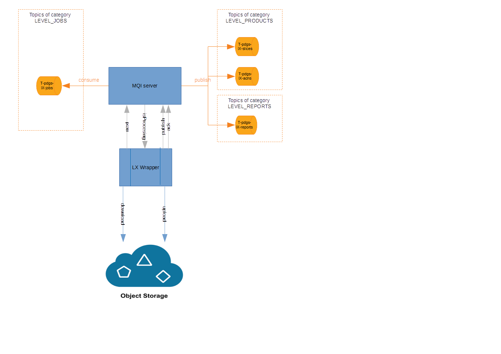

S1-PDGS Cloud POC - Wrapper
===========================

This module is in charge of preparing the working directory, executing the processes of the level and ingesting the outputs in the OBS facility and message queue system.
It gets its job from the job generator which has been developed in order to given all needed information in the job message. Thus, the wrapper can be only seen as an orders executor with no “intelligence”.
It has been designed for being used on different level with the less possible configuration.

### Sources

The ingestor is a Spring Boot application configured with annotations.

The wrapper periodically asks its MQI server for a new message:
* if no message: the wrapper will wait for the next loop
* else: the wrapper will process the job

The job processing is executed in the following manner. The job processor:

Processes the message:
1. Prepares the tasks execution
2. Prepares the working directory (detailed in paragraph “Preparing the working directory”). 
3. When the minimal inputs are present (detailed in paragraph “Executing the tasks”): executes the tasks in dedicated threads and wait for completion 
4. Processes the outputs (upload into the object storage and / or publication in Kafka) (detailed in paragraph “Processing the outputs”)

Acknowledges negatively or positively the processing of the message

Cleans the job processing:
1. Erases the working directory
2. Stops application if requested

### Builds

This project is a maven, java and spring project.

##### IDE

You can use STS (Spring Tools Suite) or Eclipse.
Required java version is >= 1.8

##### Internal dependencies

This project depends on:
* [commons](https://conf.geohub.space/wo7/lib-commons) library
* [obs-client](https://conf.geohub.space/wo7/obs-sdk) library
* [mqi-client](https://conf.geohub.space/wo7/mqi-client) library

Please install these dependencies in your local repository before building project

##### External dependency
This project depends on:
* spring-boot
* spring-boot-starter-web
* spring-boot-starter-jetty
* spring-log4j2
	
### Configuration

##### obs-aws-s3.properties
See [obs-client](https://conf.geohub.space/wo7/obs-sdk) project

##### application.yml
Below the parameters to configure for the production

Parameter                                        | Description
------------------------------------------------ | ------------- 
server.port                                      | port used for publishing REST API around wrapper status
process.level                                    | application level (L0/L1)
process.fixed-delay-ms                           | (fixed delay) period in milliseconds between 2 polls of next message
process.init-delay-poll-ms                       | the initial delay to apply before consuming messages
process.tm-proc-one-task-s                       | Timeout in second for stopping task of pool's task execution
process.tm-proc-all-tasks-s                      | Timeout in second for stopping task of pool execution
process.tm-proc-stop-s                           | Timeout in second for stopping task of job processing
process.tm-proc-check-stop-s                     | Timeout in second for stopping the task of waiting for required inputs before starting processing
process.size-batch-upload                        | the size of the batch used for uploading outputs
process.size-batch-download                      | the size of the batch used for downloading inputs
process.wap-nb-max-loop                          | the maximal number of loop when waiting for required inputs before starting processing
process.wap-tempo-s			                     | the temporisation (in second) applied between 2 loops when waiting for required inputs before starting processing
process.mqi.host-uri                             | the host and port for querying MQI server
process.mqi.max-retries                          | the maximal number of consecutive retries following a MQI request error 
process.mqi.tempo-retry-ms                       | 
status.delete-fixed-delay-ms                     | (fixed delay) period in milliseconds between 2 check if application shall be stopped or not
status.max-error-counter-processing              | the number of consecutive processing errors leading to the state FATALERROR
status.max-error-counter-mqi                     | the number of consecutive MQI errors leading to the state FATALERROR
dev.steps-activation.download			           | if false, the wrapper ignores the step around input downloading
dev.steps-activation.upload                      | if false, the wrapper ignores the step around outputs processing
dev.steps-activation.erasing                     | if false, the wrapper ignores the step around working directory cleaning
