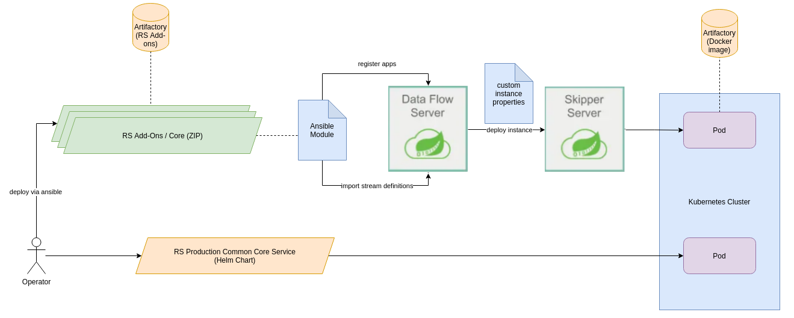

:arrow_heading_up: Go back to the [Reference System Software repository](https://github.com/COPRS/reference-system-software) :arrow_heading_up:

# production-common

## Overview

This repository contains the source code for the actual processing components used by the Copernicus Reference System.

Basically there are two different types of software that you can find here. The RS Add-ons and RS Core Components are packages that contains stream definition and configuration for SCDF in order to deploy the COPRS software into a Kubernetes cluster. Each of these packages deploys a certain chain that add some feature to the Reference System.

For example, if you deploy the XBIP ingestion chain into your cluster, you are adding the capability of retrieving input products from an XBIP instance into your local cluster. If you're adding the metadata extraction chain into it, you'll be also capable of extracting the metadata from ingested or produced products. By composing the different package, you can adjust the functions of your local instance.

While the RS Addons are usually event driven workflows, there are Standalone services that are deployed via helm in order to install them into the cluster. They are running independendly from SCDF and providing certain services that are supposed to be running all the time. For example, the Native API is not triggered by an event, but exposing its API to the user, so he can contact it any time for searching or adding products into the system.

## Installation Requirements

In order to use the software correctly within your cluster, it needs some dependencies to be operated successful. Before you deploy any software, please ensure that the COPRS infrastructure is installed correctly on your cluster. Further information on the infrastructure and how to deploy it, can be found [here](https://github.com/COPRS/infrastructure)

## How to deploy

Please consult the [Installation Manual](./docs/install_manuals/) for further information on how to deploy the software of this repository.

## How to contribute

If you're interested in rebuilding RS add-ons on your own or customize them, please consult [this](./docs/howto/README.md) documentation.

## Structure of the Repository

### processing-common

This directory contains the definitions of the default RS Core Components of the Copernicus Reference System. Each sub folder represents a own RS Core Component containing a documentation on how to use and configure the component, a definition of the workflow as well as a factory default configuration that can be used to learn how to configure the software. The factory default configuration for the RS Core components according to the ICD COPRS-ICD-ADST-001139201.

The RS Core components are build automatically when something is commited and generating a zip file that will be uploaded to the COPRS Artifactory instance. If you just want to deploy these instances, you can download the RS Core component archive directly. You can find an overview of the available components are versions [here](https://artifactory.coprs.esa-copernicus.eu/artifactory/rs-zip/).

Please note that this directory does not contain the RS Add-ons of the COPRS. They are located in different repositories, but using a similiar structure. You can find them here for:

- [Sentinel-1](https://github.com/COPRS/processing-sentinel-1)
- [Sentinel-2](https://github.com/COPRS/processing-sentinel-2)
- [Sentinel-3](https://github.com/COPRS/processing-sentinel-3)

### rs-container

When deploying either a SCDF stream definition or a standalone component it is referencing docker images. These are build together with the components itself and pushed into the project Artifactory instance.

However in some situation there are base images required that used commonly across the whole project or images that are preparing the IPF that handles the actually processing before the actual COPRS software is added.

The rs-container folder contains a set of Docker files that a generating and pushed the docker images automatically into Artifactory so it can be used by the components or when being deployed to your cluster.

### rs-core

You can find here the source code of the microservices that are used for the Copernicus Reference System. Each subfolder contains a specific application used by the COPRS. Check out this directory if you intend to work on the actual source code and improve the apps.

### rs-core-examples

The processing-common folder contains the definition of the official RS Core components that are supposed to be used. To explain how to use them and show the flexibility of the components, we created some additional configuration examples that can be used for further studies.

While these components can be deployed into your cluster as well, please note that these components and definitions are not officially supported by the project and supposed studying the different setups offered by the COPRS.

### rs-libs

This directory contains the source code of the common libraries that are used across the applications of the COPRS. Certain functions and utilities are needed by multiple microservices. In order to avoid code duplication these parts had been extracted into on libraries that are dedicated to the COPRS.

Each subfolder contains a library that is used within the system. Check this folder out if you intend to improve or study the common libraries used by the COPRS.

### rs-processing-common

A part of the RS Core Components that are deployed as stream definitions with an SCDF instance, there are a set of standalone components that are not working on an event driven approach, but instead providing some services to the system. These are usually front end applications that are exposing some kind of interface to the outside worls that can be used by end-users or other components.

Each subfolder contains a standalone component that will automatically build a helm chart that is pushed into the Artifactory instance of

A set of helm charts that are deployed as standalone components and not operated within the SCDF streams

### rs-testing

During the development of the COPRS it was identified that there are certain situations where you not want to access the operational systems directly and want to have the possibilities to carry out some test runs within your own environment.

This folder contains a set of extra components that are not supposed to be used in an operational environment. They shall help to test the system and verify local configuratons before setting it up against an operational one.

For example, you can mock the ingestion systems like the XBIP or EDIP with a local instance in order to place your own products locally into the inbox.

Some additional helm charts that can be used to mock systems.

## Documentation

### Architecture Design Document

In order to get an overview about the architecture of the overall design of COPRS and the software components, please consult the Architecture design document that can be found [here](./docs/architecture)

### Installation Manual

For further information on deploying the RS Core Components or RS Standalone Components, please consult the Installation Manual, that can be found [here](./docs/install_manuals)

### Reports

The build pipe of this project is automatically generating Sonarqube reports for each module when it is build. This allows an easy overview about the status of the project. You can check the reports of the project [here](https://sonarqube.coprs.esa-copernicus.eu/projects)
