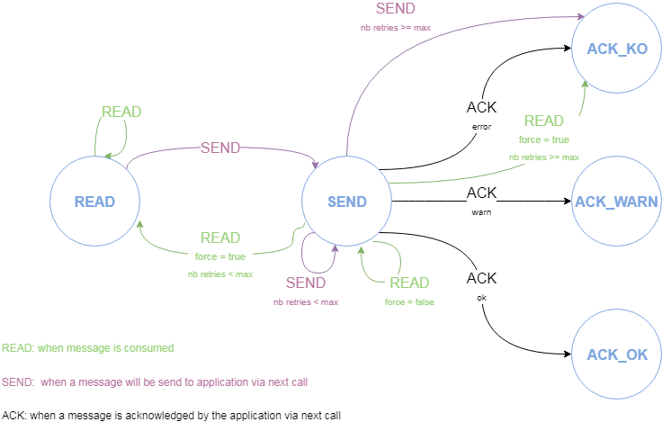
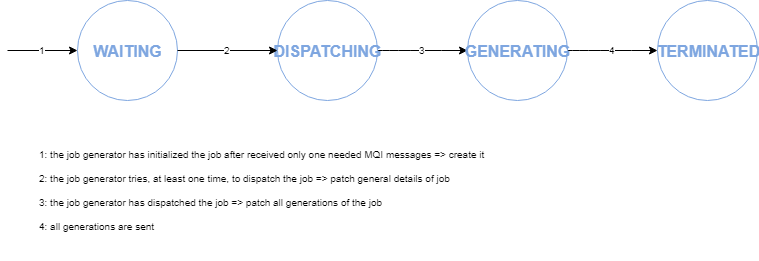
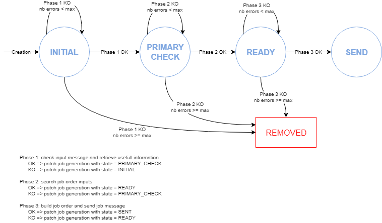

S1PDGS Cloud POC - Applicative data Catalog
===========================================

The server proposes API for persisting:
* The MQI messages
* The work in progress of job generators

### Sources

The applicative data catalog is a Spring Boot application configured with annotations.

##### MQI messages

So, the applicative data catalog manages the MQI messages and especially their persistence and their state’s transitions.

The server offers REST APIs to apply transitions and get information about MQI messages:
* Read: called when the MQI server consumes a message (lead to the transition “READ”) 
* Send: called when the MQI server wants to send the message to its application (lead to the transition “SEND”)
* Ack: called when the MQI server wants to acknowledge a message after receiving the ack from its application (lead to the transition “ACK”)
* Next: returns all MQI messages assigned in reading to a pod
* Earliest offset: returns the offset on which a Kafka consumer shall seek after a rebalance
* Nb reading message; returns the number of messages in state “READ” for a given pod (this is used by the scaler to add this number to the Kafka lag)
* Get: get a message

A REST controller is instantiated for each product category.
See the document R03 about REST APIs for more details.

Furthermore, tasks are configured to remove periodically:
* the MQI messages in state ACK_OK, ACK_KO or ACK_WARN for too long (configurable, default 7 hours)

##### Job generator jobs

The applicative catalog manages the work in progress of the job generators and especially their persistence and their state’s transitions.

The catalog offers REST APIs to manage jobs:
* Search: search jobs by passing a list of filters 
* One: get one job from its identifier
* newJob: create a job
* deleteJob: delete a job
* patchJob: patch job details (state, pod) and optionally its messages, its product, its generations
* patchGenerationOfJob: patch status for a job and a task table

A REST controller is instantiated for the EDRS_SESSIONS category, and one for the LEVEL_PRODUCTS category.
See the document R03 about REST APIs for more details.

Furthermore, tasks are configured to remove periodically:
* the terminated jobs for too long (configurable, default 10 minutes)
* the jobs in transitory state (WAITING, DISPATCHING, GENERATING) for too long (configurable, default 7 hours)
* the generations with maximal number of retries reached
* the generations in transitory state for too long (configurable, default 7 hours)

### Builds

This project is a maven, java and spring project.

##### IDE

You can use STS (Spring Tools Suite) or Eclipse.
Required java version is >= 1.8

##### Internal dependencies

This project depends on:
* [commons](https://conf.geohub.space/wo7/lib-commons) library

Please install these dependencies in your local repository before building project

##### External dependency
This project depends on:
* spring-boot
* spring-web
* spring-log4j2
* spring-data-mongodb
	
### Configuration
TODO
