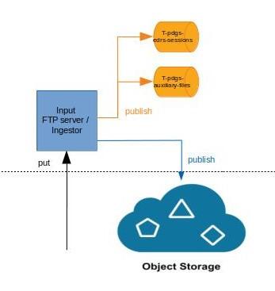

S1-PDGS Ingestor
================
The ingestion component is composed by:
* An input FTP server: proposes a FTP interface for external systems to send input files (AUX/MPL configuration files or EDRS session files) to the processing chain
* An ingestor: ingests valid input files into the object storage and makes them available to others systems

### Sources

The ingestor is a Spring Boot application configured with annotations.

There are 3 packages:
* files: main component for managing files
* kafka: services (publisher) and configuration for publishing in a KAFKA topic
* obs: service and configuration for accessing to the OBS

### Builds

This project is a maven, java and spring project.

##### IDE

You can use STS (Spring Tools Suite) or Eclipse.
Required java version is >= 1.8

##### Internal dependencies

This project depends on:
* [commons](https://conf.geohub.space/wo7/lib-commons) library
* [obs-client](https://conf.geohub.space/wo7/obs-sdk) library

Please install these dependencies in your local repository before building project

##### External dependency
This project depends on:
* spring-boot
* spring-integration
* spring-log4j2
* spring-kafka
	
### Configuration

##### obs-aws-s3.properties
See [obs-client](https://conf.geohub.space/wo7/obs-sdk) project

##### application.yml
Below the parameters to configure for the production

| First Header                                     | Second Header |
| ------------------------------------------------ | ------------- |
| kafka.bootstrap-servers                          | the bootstrap servers for KAFKA
| kafka.group-id                                   | the group identifier to use for KAFKA publishers
| kafka.poll-timeout                               | the bootstrap servers for KAFKA (example: kafka-svc:9092)
| kafka.producer-retries                           | the maximal number of retries when publishing a message = parameter "retries" of KAFKA producer configuration
| kafka.topic.auxiliary-files                      | the name of the topic used for the auxiliary files
| kafka.topic.edrs-sessions                        | the name of the topic used for EDRS sessions
| file.auxiliary-files.read-fixed-rate             | the fixed rate in milliseconds to read configuration files on local directory (example: 1000)
| file.auxiliary-files.read-fixed-rate             | the fixed rate in milliseconds to read configuration files on local directory (example: 1000)
| file.auxiliary-files.read-fixed-rate             | the fixed rate in milliseconds to read session files on local directory (example: 1000)

