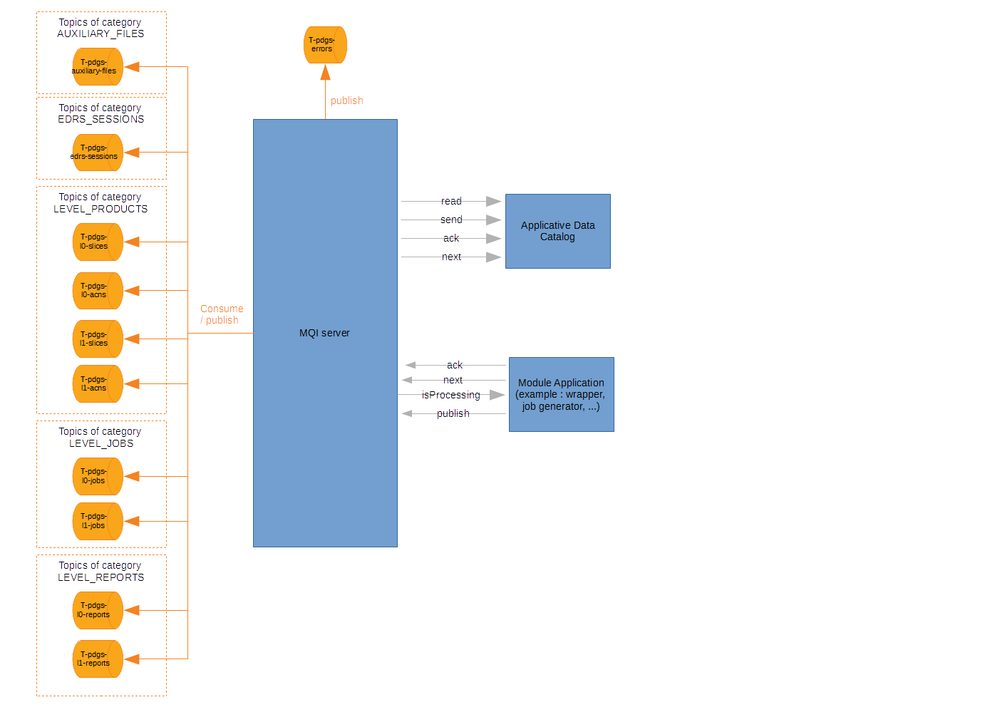
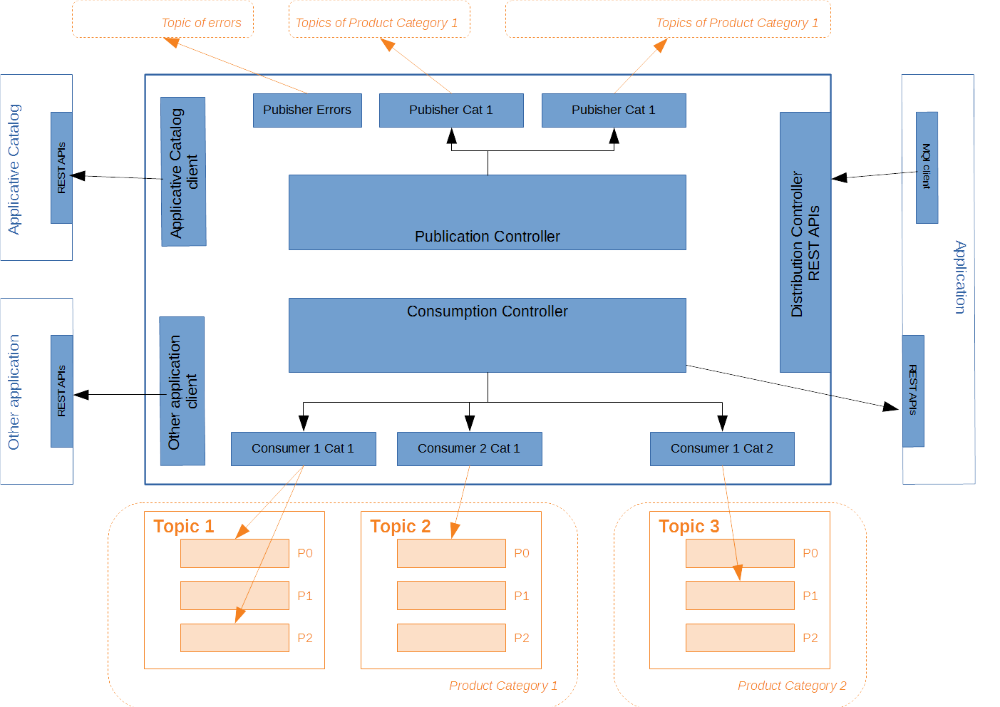

S1-PDGS Cloud POC - Message Queue Interface server
==================================================

The MQI server is in charge of:
* consuming KAFKA messages (which includes managing KAFKA offsets and rebalance):
  * managing KAFKA offsets and rebalance
  * distributing messages to the application of the module with a priority strategy
  * acknowledging their processing and eventually publishing processing errors
* publishing processing outputs in KAFKA topics
* publishing errors in KAFKA topics

A MQI server has no sense if it is not associated to a processing application.

To be robust to KAFKA rebalance and untimely reboots, the messages are stored in the applicative database.

Some use-cases are available in [this file](./build/use-cases.xlsx)

### Sources

The module has 3 main controllers:
* Message consumption (internal)
* Message distribution (REST server)
* Message publication (REST server)

### Builds

This project is a maven, java and spring project.

##### IDE

You can use STS (Spring Tools Suite) or Eclipse.
Required java version is >= 1.8

##### Internal dependencies

This project depends on:
* [commons](https://conf.geohub.space/wo7/lib-commons) library
* [app-catalog-client](https://conf.geohub.space/wo7/obs-sdk) library

Please install these dependencies in your local repository before building project

##### External dependency
This project depends on:
* spring-boot
* spring-boot-starter-web
* spring-boot-starter-jetty
* spring-log4j2
* spring-kafka
* kafka-lag-based-assignor
	
### Configuration

##### application.yml
Below the parameters to configure for the production

Parameter                                        | Description
------------------------------------------------ | ------------- 
TODO