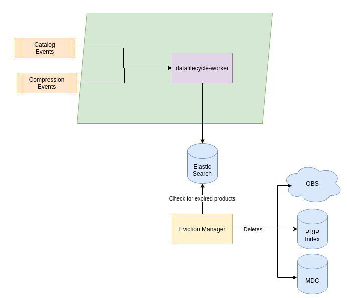

:arrow_heading_up: Go back to the [Production Common Documentation Overview](../README.md) :arrow_heading_up:

# COPRS-PRO-ADD RS Processing Architecture and Design Document

## Summary

This document aims to provide the software architecture in cloud environment of Processing sub-system of Copernicus Reference System.

## Table Of Contents
1. [Introduction](#1-introduction)
2. [Software Design Overview](#2-software-design-overview)
3. [Software Architecture Design](#3-software-architecture-design)
4. [Software Component Design](#4-software-component-design)

## 1 Introduction

This document aims to provide the software architecture in cloud
environment of **Copernicus Processing Reference System (COPRS)**
project.

### 1.1 Purpose and Objective

The Reference System provides  platform for production and distribution of  of Sentinel-1, Sentinel2 and Sentinel-3 data, serving as key functional of  Copernicus Space Component (CSC) Ground Segment.

The Processing (PRO) subsystem of the Copernicus Reference System is responsible for core features of processing chain Level0 ,Level1 and Level2 for Sentinel1/2/3 satellites. 

This document aims to describe the software architecture used for the processing sub-system of COPRS project.

### 1.2  Applicable and Reference  Documents
Applicable and Referenced documents are the documents which have reference or relation to the inputs to the writing of this document.

| **Document ID** | **Document Name** |
|---------|--|
|  COPRS-PRO-IM    | Installation Manual |
|  COPRS-PRO-SVD    | Software Verification and Validation Test |

## 2 Software Design Overview

2.1 [Design Standard and Convention](#design-standard-and-convention)
2.2 [Software Static Architecture](#software-static-architecture)
2.3 [Interfaces Context](#interfaces-context)
2.4 [Long Lifetime Software](#long-lifetime-software)
***
The following sections are giving an overview about the architecture and strategies that will be used for the COPRS 1.1, on trying to justify the decisions that had been made.

Currently the COPRS system is used operationallym in the version 1.0 that is based on the S1PRO software that had been orginally developed in order to run the Ground Segment for Sentinel-1.

That system is being operated on a set of micro services that are connected with Kafka with each other. However the workflows in that system are rather static and needs configuration files to be adjusted in order to modify the existing workflows or changing the behaviour of the microservices.

The goal is to transform the existing software in such a way that it can be used together with SCDF. This will have an impact on the way how the software will be deployed to the cluster as well as the configuration will be set.

### Design Standard and Convention
In order to give a better overview about the general system and focus on the important aspects, most diagrams shown will be an abstraction of the system behind. Thus most of the diagrams will show that the microservices are communicating with each other.

However normally between all microservices there will be kafka topics that are storing the events and handling the communication between the different services. Just in case the kafka system will be important, it will be shown. Additionally the diagrams will in general also not provide information about different timeliness that are existing within the system.

### Software Static Architecture

The RS provides the processing chain in a Cloud environment by containerizing the micro-services enabling the systematic processing of the Sentinel satellites data. For Sentinel-1, Sentinel-2 and Sentinel-3 satellits the raw data received by XBIP and EDIP is systematically processed and made available to end consumers via PRIP.

The RS implements XBIP (X-band Ground Station Data Delivery Point) interface to ingest the downlinked raw data from the CGS centres. The XBIP interface allows the downloading of DSIBs & DSDBs using the WebDAV (HTTPS based) protocol over the internet. The RS Service detects and downloads the raw data using its Trigger and Worker components.The RS also impelemnts EDIP ("EDRS-ICD-ADSO-1000830938) interfaces  are used by PRO to poll for new CADU/DSIB files and download and ingest raw files.

### Interfaces Context
Following context diagram illustrates the relationship between the RS PRO system with other systems.

### Long Lifetime Software

All RSPRO components are based on widely used and well supported COTS and standard protocols which allow a long lifetime support:

- **Programming language**
	- Java
	- Spring Cloud Data Flow (SCDF)
- **Database management system**
	- MongoDB
	- Elasticsearch
- **Messaging System**
	- Kafka
- **Operating system**
	-	 Linux OS, 
	-	 Kubernetes and Docker based
- **Deployoment**
	-  Ansible
	-  Helm
- **Storage system**
	- Object Store provided by Cloud provider,(Amazon S3 API)
	- Ceph Rook

## 3 Software Architecture Design
3.1 [Overall Architecture](#overall-architecture)
3.2 [Software Data Model](#software-data-model)
3.3 [Software Trade-offs](#software-trade-offs)
***
### Overall Architecture
The diagram below depicts architectural overview of RS Processing sub-system

The RS PRO system is composed structurally by software modules which are split in three different type of components (or microservices):

Trigger
- translate Event in Job based on rules
- could have REST interface to e.g. create on-demand Job
- Scaling-needs: low

Worker
- execute Job à result in new Event or second-step-job
- Scaling-needs: high
- Jobs have status (running, failed, restart, …) but Events not

Frontend components
- Provide REST interfaces for access to persistence (e.g. queries)
- Scaling-needs: low

## Software Data Model

#### Product categories and families

The RS PDGS products and files are grouped into families, themselves
grouped into categories.

<table>
<colgroup>
<col style="width: 26%" />
<col style="width: 22%" />
<col style="width: 50%" />
</colgroup>
<thead>
<tr class="header">
<th><strong>Category</strong></th>
<th><strong>Family</strong></th>
<th><strong>Files and products</strong></th>
</tr>
</thead>
<tbody>
<tr class="odd">
<td>AUXILIARY_FILES</td>
<td>AUXILIARY_FILE</td>
<td>auxiliary files needed for level processing (AUX and MPL files)</td>
</tr>
<tr class="even">
<td>EDRS_SESSIONS</td>
<td>EDRS_SESSION</td>
<td>RAW and XML files of sessions</td>
</tr>
<tr class="odd">
<td>PLANS_AND_REPORTS</td>
<td>PLAN_AND_REPORT</td>
<td>Plans and reports for S1MIS</td>
</tr>
<tr class="even">
<td rowspan="4">LEVEL_JOBS</td>
<td>L0_JOB</td>
<td>Jobs of the level 0</td>
</tr>
<tr class="odd">
<td>L1_JOB</td>
<td>Jobs of the level 1</td>
</tr>
<tr class="even">
<td>L2_JOB</td>
<td>Jobs of the level 2</td>
</tr>
<tr class="odd">
<td>L0_SEGMENT_JOB</td>
<td>Jobs of the level 0 segment</td>
</tr>
<tr class="even">
<td rowspan="7">LEVEL_PRODUCTS</td>
<td>L0_SLICE</td>
<td>Slices of the level 0</td>
</tr>
<tr class="odd">
<td>L0_ACN</td>
<td>ACNs of the level 0</td>
</tr>
<tr class="even">
<td>L0_BLANK</td>
<td>Slices of level 0 which do not handle a L1 processing (GP and HK for example)</td>
</tr>
<tr class="odd">
<td>L1_SLICE</td>
<td>Slices of the level 1</td>
</tr>
<tr class="even">
<td>L2_SLICE</td>
<td>Slices of the level 2</td>
</tr>
<tr class="odd">
<td>L1_ACN</td>
<td>ACNs of the level 1</td>
</tr>
<tr class="even">
<td>L2_ACN</td>
<td>ACNs of the level 2</td>
</tr>
<tr class="odd">
<td>LEVEL_SEGMENTS</td>
<td>L0_SEGMENT</td>
<td>Segment of level 0</td>
</tr>
<tr class="even">
<td rowspan="4">LEVEL_REPORTS</td>
<td>L0_REPORT</td>
<td>reports of the level 0</td>
</tr>
<tr class="odd">
<td>L1_REPORT</td>
<td>reports of the level 1</td>
</tr>
<tr class="even">
<td>L2_REPORT</td>
<td>reports of the level 2</td>
</tr>
<tr class="odd">
<td>L0_SEGMENT_REPORT</td>
<td>reports of the level 0 segment</td>
</tr>
<tr class="even">
<td rowspan="12">COMPRESSED_PRODUCTS</td>
<td>AUXILIARY_FILE_ZIP</td>
<td>compressed auxiliary files</td>
</tr>
<tr class="odd">
<td>L0_ACN_ZIP</td>
<td>compressed ACNs of the level 0</td>
</tr>
<tr class="odd">
<td>L0_SEGMENT_ZIP</td>
<td>compressed segment of level 0</td>
</tr>
<tr class="even">
<td>L0_SLICE_ZIP</td>
<td>compressed slices of the level 0</td>
</tr>
<tr class="odd">
<td>L1_ACN_ZIP</td>
<td>compressed ACNs of the level 1</td>
</tr>
<tr class="even">
<td>L1_SLICE_ZIP</td>
<td>compressed slices of the level 1</td>
</tr>
<tr class="odd">
<td>L2_ACN_ZIP</td>
<td>compressed ACNs of the level 2</td>
</tr>
<tr class="even">
<td>L2_SLICE_ZIP</td>
<td>Compressed slices of the level 2</td>
</tr>
<tr class="even">
<td>JOB_ORDER</td>
<td>Used for creating the file JobOrder.xml 
Not directly put in a message queue</td>
</tr>
</tbody>
</table>

#### Message format per topic

<table style="width:100%;">
<colgroup>
<col style="width: 15%" />
<col style="width: 19%" />
<col style="width: 58%" />
<col style="width: 6%" />
</colgroup>
<thead>
<tr class="header">
<th><strong>Product Category</strong></th>
<th><strong>Message format</strong></th>
<th><strong>Exemple</strong></th>
<th><strong>Topic example</strong></th>
</tr>
</thead>
<tbody>
<tr class="odd">
<td>AUXILIARY_FILES</td>
<td>{ 
'productName': "{product name}", 
'keyObjectStorage': "{key in the object storage of the file used to extract metadata}" 
}</td>
<td>{ 
"productName": "S1A_OPER_MPL_ORBSCT_20140507T150704 _99999999T999999_0020.EOF", 
"keyObjectStorage": "S1A_OPER_MPL_ORBSCT_20140507T150704 _99999999T999999_0020.EOF" 
} 
{ 
"productName": "S1A_AUX_PP1_V20171017T080000 _G20171013T101236.SAFE", 
"keyObjectStorage": "S1A_AUX_PP1_V20171017T080000 _G20171013T101236.SAFE/manifest.safe" 
}</td>
<td>t-pdgs-aux-ingestion-events</td>
</tr>
<tr class="even">
<td>EDRS_SESSIONS</td>
<td>{ 
"objectStorageKey": "{key in the object storage}", 
"channelId": {channel identifier}, 
"productType": {product type: RAW or SESSION}, 
"satelliteId": "{satellite identifier}", 
"missionId": "{mission identifier}" 
}</td>
<td>{ 
"objectStorageKey": "S1A/L20171109175634707000125/ch01/DCS_02_ L20171109175634707000125_ch1_DSIB.xml", 
"channelId": 1, 
"productType": "SESSION", 
"satelliteId": "A", 
"missionId": "S1" 
} 
{ 
"objectStorageKey": "S1A/L20171109175634707000125/ch01/DCS_02_ L20171109175634707000125_ch1_DSDB_00014.raw", 
"channelId": 1, 
"productType": "RAW", 
"satelliteId": "A", 
"missionId": "S1" 
}</td>
<td>t-pdgs-session-file-ingestion-events</td>
</tr>
<tr class="odd">
<td>PLAN_AND_REPORT</td>
<td>
{

"productFamily":"PLAN_AND_REPORT",

"keyObjectStorage": "{key in the object storage}", 

"uid":"{reporting task uid}",

"creationDate":"{event creation date}",

"hostname":"{event creation hostname}",

"productName":"{product name}",

"relativePath":"{file pickup path in inbox}"

}
</td>
<td>
{

"productFamily":"PLAN_AND_REPORT",

"keyObjectStorage":"S1A_OPER_REP_MP_MP__PDMC_20200303T093232_V20200303T170000_20200319T190000.xml",

"uid":"045fea50-0893-46ef-839b-2e095bce438a",

"creationDate":"2020-03-31T10:37:50.572Z",

"hostname":"s1pro-plan-and-report-ingestion-0",

"productName":"S1A_OPER_REP_MP_MP__PDMC_20200303T093232_V20200303T170000_20200319T190000.xml",

"relativePath":"S1A_OPER_REP_MP_MP__PDMC_20200303T093232_V20200303T170000_20200319T190000.xml"

}
</td>
<td>t-pdgs-plan-and-report-ingestion-events</td>
</tr>
<tr class="even">
<td>LEVEL_JOBS</td>
<td>
{

“family”: “{level job family: L0_JOB | L1_JOB}

"productIdentifier": "{session identifier}",

"workDirectory": "{local work directory for IPF execution workers}",

"jobOrder": "{local path of the job order XML file in the IPF execution worker}",

"inputs": [  {

  "family": "{input family: AUXILIARY_FILE | EDRS_SESSION | JOB_ORDER | L0_PRODUCT }",

  "localPath": "{local path of the input in the work directory},

  "contentRef": "{if JOB_ORDER: XML content file; if BLANK: nothing; else the key in OBS}”

}],

"outputs": [  {

  "family": "{product family: Lx_PRODUCT | Lx_ACN | Lx_REPORT}",

  "regexp":   "{regular expression for the output}"

}],

"pools": [{

   "tasks": [{

      "binaryPath": "{binary path}"

  }]

}
</td>
<td>See annexa A</td>
<td>
t-pdgs-aio-execution-jobs,

t-pdgs-l1-execution-jobs-nrt,

t-pdgs-l1-execution-jobs-fast
</td>
</tr>
<tr class="odd">
<td>LEVEL_PRODUCTS</td>
<td>
{

"family": "{family: Lx_SLICE | Lx_ACN | L0_BLANK}",

"productName": "{product name}",

"keyObjectStorage": "{key in the object storage}",

“processMode”: “NRT | FAST”

}
</td>
<td>
{

"family": "L0_SLICE",

"productName": "S1B_IW_RAW__0SSH_20180227T125035_

20180227T125107_009809_011BB2_38E5.SAFE",

"keyObjectStorage": "S1B_IW_RAW__0SSH_20180227T125035_

20180227T125107_009809_011BB2_38E5.SAFE",

“processMode”: “NRT”

}
</td>
<td>
t-pdgs-aio-l0-slice-production-events-nrt,

t-pdgs-l0asp-l0-slice-production-events-fast,

t-pdgs-aio-l0-blank-production-events
</td>
</tr>
<tr class="even">
<td>LEVEL_SEGMENTS</td>
<td>
{

"family": "{family: L0_SEGMENT}",

"productName": "{product name}",

"keyObjectStorage": "{key in the object storage}",

“processMode”: “NRT | FAST”

}
</td>
<td>
{

"family": "L0_SEGMENT",

"productName": "S1B_IW_RAW__0SSH_20180227T125035_

20180227T125107_009809_011BB2_38E5.SAFE",

"keyObjectStorage": "S1B_IW_RAW__0SSH_20180227T125035_

20180227T125107_009809_011BB2_38E5.SAFE",

“processMode”: “FAST24”

}
</td>
<td>t-pdgs-aio-l0-segment-production-events</td>
</tr>
<tr class="odd">
<td>LEVEL_REPORTS</td>
<td>{ 
"family": "{family: Lx_REPORT}", 
"productName": "{product name}", 
"content": "{content of the report file}", 
}</td>
<td></td>
<td>
t-pdgs-aio-production-report-events,

t-pdgs-l1-production-report-events,

t-pdgs-l2-production-report-events
</td>
</tr>
<tr class="even">
<td>EVICTION_MANAGEMENT_JOBS</td>
<td>{ 
"productFamily": "{product family}", 
"keyObjectStorage": "{key in object storage}", 
"uid": "{reporting task uid}", 
"creationDate": "{event creation date}", 
"hostname": "{event creation hostname}", 
"evictionDate": "{eviction date of product in obs}", 
"unlimited": {true if no eviction at all} 
}</td>
<td>{ 
"productFamily": "EDRS_SESSION", 
"keyObjectStorage": "S1A_20200120185900030888/ch02/DCS_01_S1A_20200120185900030888_ch2_DSIB.xml", 
"uid": "6af62c95-9bbb-4fb3-a75f-511c3b05f319", 
"creationDate": "2020-05-19T16:41:14.870Z", 
"hostname": "s1pro-datalifecycle-trigger-0", 
"evictionDate": "2020-01-08T21:20:15.909Z", 
"unlimited": false 
}</td>
<td>t-pdgs-eviction-management-jobs</td>
</tr>
</tbody>
</table>

Kafka Message format per topic

### Software Trade-offs

#### KAFKA Lag balance

**The starting Situation**
Each consumer is assigned only one partition. Each partition contains the same amount of messages. This is the ideal situation as all consumer can continiously process.

However for certain activities (e.g. compression, processing) the processing time of each message can be different.

**The Problem**
Assuming that Consumer 1 and 2 are having short running messages after a while this will lead to a situation where the partitions are running empty. Consumer 3 however does have messages queued up.

Assumption would be that messags from Consumer 3 are shared across the other consumers.

**The Solution**
The producer will get a customized Partition Selection strategy so that each time a new message is selected, it will evaluate the lag that is currently on the partition. Those partition with the least lag will receive the new message.

Thus when new messages are created, all consumers will be kept busy. Other strategies like round robin, sticky partitioner and default partitioner might lead to a situation where the lag is increased and consumers might run out of tasks.

Detailed trade-off provides under: https://github.com/COPRS/production-common/wiki/Trade-off-%22Load-Balance-the-Lag%22

#### Long Running Task

#### Dateline Handling

Elasticsearch supports handling of the dateline when working with polygons.
Those polygons that cross the dateline have to be marked as such (https://www.elastic.co/guide/en/elasticsearch/reference/7.14/geo-shape.html#polygon-orientation).

The metadata extraction component detects dateline crossings and adds the specific marker when a product is cataloged.

The detector first assumes that an input polygon is not crossing the dateline and calculates its width. If the width is 180° or greater, the input polygon possibly crosses the dateline. In this case, the coordinates are relocated by shifting negative longitudes by 360.0° (resulting in only positive longitudes). If the width of the relocated polygon is lower than 180°, then an alternative smaller polygon exists for the extra wide input polygon and the detector will report a dateline crossing. If the width of the relocated polygon is 180° or greater, no decision can be made, because the input polygon and the relocated polygon both appear to possibly cross the dateline. When this countercheck fails, no crossing is reported. This is to avoid false positives (e.g. when handling wide landmasks).

#### S2 Geographical Search
#TBD
Possible approaches:
- Mission specific indices for PRIP Index
- Upgrade to Elastic Search 8.1 might improve due to Treemap algorithms
- Splitting granules into a separate index and have in the PRIP index 
just datastrips (?)

#### Error Handling

#### Error situations
When a SCDF stream is executed, multiple error might occur:
1. A routing to a target is performed that does not exist
2. The message received was not formatted correctly
3. The application itself run into an error (e.g. metadata could not extracted, IPF returned error code)

#### Dead-Letter-Queue management

The request running into an error will be send to a specific DLQ (kafka topic) and processed by the DLQ manager that will check if the error can be identified based on a ruleset.

In this case the message will be rerouted back into the kafka topic of the application so it is processed again. Each time a retry attempt will be written in the Kafka header to determinate the amount of retries to ensure messages are not kept forever in the system.

If retry limit exceeded or no rule found, the message will be send to a mission specific parking lot.

#### Parking Lot
Messages from the parking lot will be processed by the parking lot application that will push the message into a mongo database to persist it. A rest interface is exposed and allows the operator to decide how to handle with this message (drop it, restart or resubmit etc).

This allows the operator to investigate the reason of the failure. 

## 4 Software Component Design

4.1 [Ingestion](#ingestion)
4.2 [Processing](#processing)
4.3 [Metadata](#metadata)
4.4 [Compression](#compression)
4.5 [Distribution](#distribution)
4.6 [Data Lifecyle](#datalifecyle)
***

### Ingestion

When producing products in the Earth Observation domain there are usually a set of input files required by the processing system. These are the main input containing the actual sensor data from the satellite and on the other hand auxiliary files (e.g. predicted orbits) that are required by the processors for the computation as well.

Before the producton can be prepared it will be required to have these products available in the local environment and the system needs to be aware that they are existin. This process is referenced as "ingestion" and will be usually fetching the products mentioned above from other system and ensure they become visible for the local processing system. 

Additionally especially main input products like EDRS sessions are used to invoke systematic workflows handling the actual processing of high level products.

The COPRS the Ingestion chain is used to detect and retrieve products from other systems like XBIP, EDIP and AUXIP. The metadata extraction of these products and adding them to the catalog will be tackled in the Metadata chain.

A generic ingestion chain will be looking like this:

The trigger is handling the dection of new products. The filter is used to discard products that are not supposed to be processed as the COPRS will not process 100% of the data. The ingestion worker handles the actual download of the remote system into the local Object Storage.

For further information in the Ingestion Chain and an example configuration, please have a look [here](https://github.com/COPRS/production-common/tree/develop/processing-common/ingestion). Please note that additional examples of inbox configuration can be found in the [examples](https://github.com/COPRS/production-common/tree/develop/rs-core-examples)

#### Ingestion Trigger

Please note that the source is not part of the COPRS environment, but rther being an remote external source like:
- XBIP (WebDAV)
- EDIP (FTP)
- AUXIP (ODATA)

The ingestion chain is a generic component and capable of handling the different kinds of protocols that are used for the sources. It is possible to setup Inbox for the Ingeston chain that will observe the specified location depending on the type of the Inbox. E.g. in case of an XBIP WebDav will be used in order to observe the source or retrieve the actual products while an EDIP Inbox will be using FTP as protocol.

Because the actual retrieval of products from the source is an IO expensive activity, it was decided to split the detection of new products from the actual retrieval process. Thus the ingestion trigger will be simply in charge to poll on the source in order to detect the availability of new products that might be interesting for the COPRS environment.

It just contains a set of inboxes on the source and polling on them. If a new product is being detected, it will fire an event to notify the other components that a new product needs to be fetched.

Additionally it will make a note and store the products that had been fired already so it will be able to detect if such an event was already fired. Thus it is prevented that the same product will be fetched multiple times and keep the system unnecessarily busy.

#### Ingestion Filter

Especially for the XBIP sources that are retrieving the actual raw input files (EDRS Session), the COPRS shall not retrieve all available files from the source. Instead just about 3% of the products shall be processed within the COPRS.

In order to control that not all products will be processed, the ingestion filter will be a filter gate for the system to ensure that just products being detected within a time interval will be actually processed.

Each ingestion filter does have a configuration based on time defining the time window where products are accepted. Products outside of this window will be simply dropped and not pulled into the system. If the product not had been filtered, it will notify the ingestion workers.

#### Ingestion Worker

Products that had been detected on the source inbox and not was discarded by the filter will be handled as requests by this component and taking over the I/O intensive activity of downloading the product from the remote source into the local Object Storage.

Similiar to the Ingestion Trigger, the Ingestion Worker is a generic component that is capable of handling the different types of sources and the required protocols. It will automatically choose what kind of protocol is required in order to retrieve the product from the source location

The downloaded product is not persisted in the ingestion worker, but directly uploaded to the local Object Storage into the bucket specified for that product type. The Ingestion Workers task is just to handle the upload of the product into the OBS and is not performing any further action on the downloaded product.

Please note that when a product is ingested into the system additional metadata from the inbox might be added to the event to make the identification of the inbox for the Metadata Extraction easier.

Each worker can handle one retrieval operation at a time, so it can be scaled up in order to increase the overal throughtput of the system easily. 

#### AUXIP
The AUXIP interface is used by COPRS to poll for new AUX files and download and ingest such files. Please note that the ingestion for this workflow is a bit different than these from XBIP and EDIP, because the products retrieved from the AUXIP are compressed files. The environment expects the products to be uncompressed to allow partial file download (e.g. Manifest) and because most processors will require it.

The AUXIP ingestion trigger component polls configured PRIP interfaces per AUXIP client (OData) to detect new AUX. Due to the nature it is not quering all products it is finding, but using a moving time window to go throught the products in order to identify products that are not pulled into the system already.

Once it reaches the current time, it will stay up-to-date following all new publications on the PRIPs as long as it is running. It will then create ingestion jobs for the AUXIP ingestion worker which will then download the files from PRIP and uploads it to OBS storage. The AUXIP ingestion trigger uses MongoDB to persist metadata about the harvested timewindow to be able to resume operation were it last left off.

Note that the products retrieved from the AUXIP are compressed and needs to be uncompressed before it can be used by the COPRS environment. Thus it is required to execute at the end of the SCDF stream an uncompression application. An example on how to configure the AUXIP chain correctly, can be found [here](https://github.com/COPRS/production-common/tree/develop/rs-core-examples/ingestion-auxip)

Credentials to log into PRIP services (OData) are configured by Kubernetes secrets and are provided to the AUXIP client as needed. Different credentials for each PRIP service are supported

#### XBIP
Ingestion-Trigger component polls XBIP interface (webdav) of ground station and detects new files (CADU & DSIB). Once a new file is detected, an ingestion job is created and send to ingestion-workers. 

To be able to detect files as "new", ingestion-trigger stores in a persistence a last-known list of files available in XBIP and can compare current content with last-known content. This is valid for nominal and retransfer folders as both will be polled systematically. IngestionJobs are put on the nominal (high-priority) or retransfer (low-priority) queue depending on their origin.

Ingestion-worker component executes an ingestion job (containing a URL, the OBS target and some additional attributes about the ground station) by downloading the file from URL and uploading to OBS. For files from retransfer a dedicated bucket is used.

One ingestion-trigger pod per XBIP station to avoid dependencies between the stations. If one station is having high lag or any other kind of connection issues, this shall not cause any negative influence on data flows from other stations.

Credentials to log into XBIP stations (webdav) are configured by Kubernetes secrets and are provided to ingestion trigger and worker as needed. It is supported to different credentials for each station.

#### EDIP
The EDIP interface, similar to XBIP, is used by COPRS services to poll for new CADU chunks and DSIB files and download and ingest such files via FTP protocol. The interface is specified in the ICD "EDRS-ICD-ADSO-1000830938"

Features:
- The directory structure of the  files is identical to the XBIP Interface.
- Interface protocol is FTP
- Directory for polling on the "Primary EDC"  is NOMINAL directory, no RETRANSFER directory present on the same server
- Authentication factor is user/password: handled in COPRS
  
### Processing

Each time a product will be added to the Metadata Catalog (nevertheless if it is ingested or produced) a catalog event will be raised to notify all components that a new product is available.

Each chain is having a filter as gate that will decide if it is responsible for doing the production. A preparation worker will verify if all preconditions are meet and generating a job order that shall be executed by an Execution Worker.

Because the origin topic will be always the catalog events, it is also possible to chain multiple processings in a systematic way. The following figure is giving an overview how the S1 AIOP and S1 L1 could be realized in the new system:

#### Filter

Each processing chain will be triggered when a new product is available and starting with a filter component that will be used as a gate for the chain and its task is to ensure that just events are processed they can handle. 

The filter is supposed to be lightweight and working in a similiar way than the MQI filter mechanism that had been used before. So product family, product type and mission might be the main criteria to decide if the chain is able to handle this processing. The filter is not supposed to contain more complex processing logic (e.g. if all chunks of a session are available). The only purpose is to define if the chain can be used to perform the processing.

#### Preparation Worker
If a new request for a main input product is detected, it will perform a check if its mandatory input files are already existing. If its the case, it can directly generate the job order and continue. If at the moment however not all criteria are fullfilled, it will store the job into a job database.

This will not be working in a global way anymore, but instead each processing chain does have its own database to ensure that the processing requests not interfer with each other.

The persistence is required to ensure that the jobs can be handled in a different order than they arrive at the kafka partitions they are reading from. Else it might happen that if an auxiliary data is not arrived correctly, the system will not continue with other jobs that might be ready to start already. This is not wanted behaviour as the production shall be invoked whenever  ready.

After the new job is persisted, the service will also check if other old job that are persisted might be meanwhile be ready and can be launched. If no production is ready, the workflow will be discarded and discontinued.

Thus each time a new catalog event arrived, the preparation worker is invoked and checking if preconditions are fullfilled. Using this approach it is not longer necessary to use a time based polling. Because if no new products are added to the system, the precondition for the inputs will not be different.

Once a production is ready to go, the Preparation Worker will generate a Job Order containing the inputs that had been choosed for the production and will publish it on the queue of the execution worker, so it can do the actual processing.

#### Execution Worker
While all services before are basically organize and setup the production, the execution worker is the service that is performing the actual processing operation. It is however also in charge to prepare the working directory and monitoring the results of the production.

The execution worker will receive an job from the preparation worker. At this moment all decision about the input products had been made already and are listed within the Job Order. The execution worker will not do any further decision on what to produce, but just following the instructions from the order.

It initialize a clean working directory that will be used as processing environment by the IPF. The input products that had been selected by the Preparation Worker and downloaded from the OBS storage from the associated buckets and placed within the working directory.

When the production is prepared, the Execution Worker will launch the binary from the task table to invoke the actual production by executing the CFI binary within the working directory and providing the Job Orders as input.

The binary takes over the control and the execution worker will read the stdout messages and logging them accordingly. Once the binary is finished, it will return an exit code and indicate the outcome of the production. 

If error code 0 is returned, it means that the production was successful. A .LIST file will be generated to list the products that had been produced and needs to be extracted. If an higher exit code is returned this might indicate an issue. An exit code of 1-127 might indicate a warning, but is considered still successful. An even higher exit code might indicate instead an error, so that the production is not generated correctly.

In this case, the Execution Worker will not continue with the processing, but publish an error on the Dead Letter Queue to raise the attention of the operator team to investigate the reasons for this failure.

If the production was successful, the Execution worker will parse the content of the .LIST file and starting to upload the produced outputs into the OBS storage into the associated buckets.

After the upload, it will clean up the working directory to ensure no disk space leaks might occur and publishing a new production event. At this moment the products are not visible for the system and the metadata catalog will, handle the extraction of the metadata of the freshly generated products and making them visible after they had been added to the catalog.

### Metadata

When a new product was ingested into the COPRS environment it will be just available at the OBS store, however the system will not be immediatly aware of these products. It is required to extract the metadata of the products first and store them into the local catalog to make them visible for the overall system.

This is also required when a product was not ingested, but had been produced by a processing chain. The product will be uploaded to the OBS, but will not be visible for the overal system. Thus its metadata needs to be extracted.

The Metadata Extraction chain is tackling exactly this activity. Because the different product types and missions are having different types of products, the Metadata extraction needs to be suitable for the different formats and store them in an homogenous catalog, so it is possible to access the product metadata in the same way from all systems.

#### Filter

The filter within the RS Core Metadata chain can be used as a gate to specify what products shall be ingested into the Metadata Catalog. This can be used to avoid that products like reports are actually added into the catalog. Additionally it can be used to specify a mission specific metadata extraction, e.g. if it is required to scale the amount of extractors on a mission base. In this case the filter can be configured to just accept a specific mission.

The message filter is a basic SCDF component that allows to filter out products based on the payload of the event.

#### Extraction

The SCDF application Extraction takes the product from the received event and will identify the type of extraction that is required for them. It will then fetch the metadata from the OBS (e.g. the manifest file for a SAFE product) and start with the extraction of the metadata. The result will be stored within the Elastic Search index related to the product and it will become visible for other application within the system. Products that are not extracted yet, will not be visible e.g. via the Metadata Search Controller.

### Browse Image

TBD: The browse image extractor is not required before V2 and thus is not available at the moment.

A processor that is extracting the browse image depending on the input file. Might be a simple selection from product or invoking a conversion (e.g. S2 JPEG2k -> JPG).

The extracted image will be uploaded into the OBS and the image written into the browse image catalog.

### Compression

Earth observation products can be either single files or directory products that contains multiple files in an organized way. Especially during download these directory products can be a problem as the End User usually just wants to download a single file as it is easier ot handle and is faster than downloading multiple small files sequentially.

Thus the compression chain can be used to compress a product. It will be listening on "Catalog Events" for new products. A generic SCDF filter is running in the front and allows to specifiy Product Families or file name patterns of products that shall be handled by the Compression chain. This allows to discard products that are not supposed to be compressed and then published on the DDIP index. Thus the filter is working like a gate that will just let products pass that shall be compressed.

Because products can be easily multiple Gigabyte in size, the compressions does usually take a few seconds. To ensure that products with low priorities are not blocking these with a high priority, the Stream splits into three different priorities:
* low
* medium
* high

Each priority will be gated by another filter that allows to specify the criteria for the priority. In most cases it can be assumed that the timeliness from the event will be the criteria to determinate the priority of the requests. E.g. in S1 if it is "FAST24" it would be a high priority, while NRT would be medium priority. If no timeliness is provided the low priority chain can be performed.

On each of the priority chains individual compression worker can be configured to scale the amount of workers for certain priorities. E.g. it might be wanted to run more workers for the high priority chain than for the lower ones to ensure that products are processed in a faster manner and not queued up for a long time.

The Compression worker itself will download the product into a local working directory, performing the compression command that had been configured on it and uploading the compressed product into the OBS. Please note that this will change the product family as well as a "-zip" suffix will be added to indicate the product is a compressed one.

At the end of the chain a "Compression Event" will be generated that will be usually consumed by the Distribution chain handling the publication of the product and make it available for the End users.

For further information on the compression chain, please have a look [here](https://github.com/COPRS/production-common/tree/develop/processing-common/compression)

#### Message Filter
The message filter is a basic SCDF component that allows to filter out products that are not supposed to be compressed.

#### Priority Filter
Similiar to the message filter, the priority filter is also a basic SCDF component that is supposed to split the requests into different priority chains. Each priorty filter defines what kind of criteria they would like to have to assume a certain priority for the compression. E.g. if a timeliness "FAST24" is defined, the request will be assumed to be high priority. Please ensure that all filters are not overlapping each others criteria and each filter can be assigned only to a single priority.

#### Compression Worker

The compression worker is performing the actual compression of the product. It will take the product referenced in the catalog event, download it into a local working directory and execute the configured compression script to perform the compression.

The kind of compression that is used is depending on the mission. The compression worker will read the missionId from the Catalog Event. Depending on the mission it is possible to define a compression script that shall be used. By default S1 will use compressed ZIP, S2 will use tar and S3 will use uncompressed ZIP. For further information on the configuration, please consult the parameter configuration for the Compression worker that can be found [here](/processing-common/compression/doc/ReleaseNote.md)

After the compression had been performed successfully the result will be uploaded into the OBS. Please note that it will not be uploaded into the same bucket as the original product. Instead the bucket and product family will add a suffix "-zip" to indicate it actually references a compressed product and to distinguish between these.

### Distribution

The Distribution chain is resposible for publishing products that had been produced within the COPRS environment to the published on the PRIP index. After it was published, it will be available for the external users of the system via the DDIP interface or the native API or searchable in the User Web Client.

Because products that are downloadable via the DDIP are usually compressed products as handling directory products can be tricky, the distribution chain is usually executed after the Compression chain had been performed. Thus the chain listens on "compression-events" and just having a single sink that handled the publication.

The Distribution worker will take the product from the event and perform a query on the Metadata Catalog Search Controller to query the metadata of the uncompressed product from the Metadata Catalog. A DDIP compatible entry will be generated and published on the index making the product available.

After the publication no further steps are performed. Thus this chain is usually a endpoint that does not triggering any further activities. Once a product had been produced by the processing chain, it will be ingested into the Metadata Catalog

The products produced by the IPFs will be in general directory prodcuts containing multiple files. This is making the download of these products difficult. Thus there exists a compression chain that will take a normal product from the OBS and performing a compression option on it to ZIP the product into a single archieve.

For further information on the Distribution chain, please have a look [here](https://github.com/COPRS/production-common/tree/develop/processing-common/distribution)

#### Distribution Worker
The Distribution worker handled the publication of products on the DDIP index in order to make them queriable for external users. It's only task is to handle the registration of the products and no other activities are performed on the product itself.

As download URL it will take the compressed products that had been placed while the product had been processed by the compression Chain.

#### DDIP Frontend
While the Distribution Worker will just handle the generation of the entries in the DDIP index, the [DDIP Frontend](/production-common/tree/develop/rs-processing-common/ddip_frontend) will handle incoming requests for the users or other systems. 

Please note that it is not integrated as SCDF stream as it is not an event based component, but is [deployed](/production-common/tree/develop/rs-processing-common) as a Helm Chart as standalone component.

It will then provide a [OData](https://www.odata.org/) interface that can be used to query on the index. The queries are handled and queries on the PRIP index within the Elastic Search cluster are performed to return the results to the end user.

### DataLifecyle

The Datalifecycle chain is responsible for memorizing the point of time when files enter the system or are compressed, and for removing expired files and its metadata.

On each Catalog and Compression Event, the Data Lifecycle Worker calculates an expiration date for the file of the event in consulting the configured retentions policies and updates its index for that file. The part of DLM responsible for eviction is provided by the Eviction Manager service that is running independently. It works with a scheduler that runs periodically and checks for expired files and removes them from the Object Store, Metadata Catalog and PRIP index accordingly.

Persistence backend for the Datalifecycle is an Elasticsearch index named 'data-lifecycle-metadata' where all data relevant for eviction is stored:

| Metadata | Details |
|-|-|
| ProductName | Name of the product |
| PathInUncompressedStorage | OBS path. If null/empty file is not available in uncompressed storage, evicted or just being stored and the Data Lifecycle Worker was not informed yet |
| ProductFamilyInUncompressedStorage | Product family of product stored in the uncompressed storage (e.g. AUXILIARY_FILE) |
| LastInsertionInUncompressedStorage | Last date the product was stored in the uncompressed storage |
| EvictionDateInUncompressedStorage | Date of eviction from the uncompressed storage and Metadata Catalog |
| PathInCompressedStorage | OBS path. If null/empty file is not available in compressed storage, evicted or just being stored and the Data Lifecycle Worker was not informed yet |
| ProductFamilyInCompressedStorage | Product family of product stored in the compressed storage (e.g. AUXILIARY_FILE_ZIP) |
| LastInsertionInCompressedStorage | Last date the product was stored in the compressed storage |
| EvictionDateInCompressedStorage | Date of eviction from the compressed storage and PRIP index |
| LastModified | Last date the product is updated (inserted into storage or evicted) |
| AvailableInLta | Will remain empty. This is taken over from S1 context, but is not used in the Reference System at the moment |
| LastDataRequest | Will remain empty. This is taken over from S1 context, but is not used in the Referenc System at the moment |
| PersistentInUncompressedStorage | Will remain empty. This is taken over from S1 context, but is not used in the Reference System at the moment |
| PersistentInCompressedStorage | Will remain empty. This is taken over from S1 context, but is not used in the Reference System at the moment |
