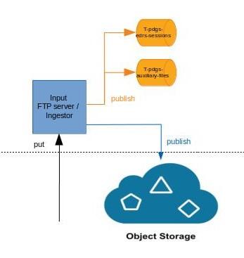

S1-PDGS Ingestor
================
The ingestion component is composed by:
* An input FTP server: proposes a FTP interface for external systems to send input files (AUX/MPL configuration files or EDRS session files) to the processing chain
* An ingestor: ingests valid input files into the object storage and makes them available to others systems

### Sources

The ingestor is a Spring Boot application configured with annotations.

There are 3 packages:
* files: main component for managing files
* kafka: services (publisher) and configuration for publishing in a KAFKA topic
* obs: service and configuration for accessing to the OBS

### Builds

This project is a maven, java and spring project.

##### IDE

You can use STS (Spring Tools Suite) or Eclipse.
Required java version is >= 1.8

##### Internal dependencies

This project depends on:
* [commons](https://conf.geohub.space/wo7/lib-commons) library
* [obs-client](https://conf.geohub.space/wo7/obs-sdk) library

Please install these dependencies in your local repository before building project

##### External dependency
This project depends on:
* spring-boot
* spring-integration
* spring-log4j2
* spring-kafka
	
### Configuration

##### obs-aws-s3.properties
See [obs-client](https://conf.geohub.space/wo7/obs-sdk) project

##### application.yml
Below the parameters to configure for the production

Parameter                                        | Description
------------------------------------------------ | ------------- 
kafka.bootstrap-servers                          | the bootstrap servers for KAFKA
kafka.group-id                                   | the group identifier to use for KAFKA publishers
kafka.poll-timeout                               | the bootstrap servers for KAFKA (example: kafka-svc:9092)
kafka.producer-retries                           | the maximal number of retries when publishing a message = parameter "retries" of KAFKA producer configuration
kafka.topic.auxiliary-files                      | the name of the topic used for the auxiliary files
kafka.topic.edrs-sessions                        | the name of the topic used for EDRS sessions
status.delete-fixed-delay-ms                     | (fixed delay) period in milliseconds between 2 check if application shall be stopped or not
status.max-error-counter-aux                     | the number of consecutive processing errors for auxiliary files leading to the state FATALERROR
status.max-error-counter-ses                     | the number of consecutive processing errors for EDRS session leading to the state FATALERROR
file.auxiliary-files.local-directory             | the directory of the FTP server for auxiliary files (MUST CONTAIN THE LAST '/' CHARACTER)
file.auxiliary-files.poll-fixed-delay            | (fixed delay) period in milliseconds between 2 poll "max-msg-per-poll" files in the local directory for auxiliary files 
file.auxiliary-files.max-msg-per-poll            | the maximal number of files to get at each poll
file.auxiliary-files.executor-pool-size          | the number of file processors in parallel (must be < max-msg-per-poll) 
file.auxiliary-files.clean-empty-directory-rate  | (fixed delay) period in milliseconds between 2 execution of the task cleaning the empty sub-directory of the local directory 
file.auxiliary-files.clean-empty-min-age			| minimal number of milliseconds after the last modified data of the file for deleting it
file.auxiliary-files.cache-max-capacity          | the size of the map used for caching the last polled distinct filenames
file.session-files.local-directory               | see file.auxiliary-files.local-directory description
file.session-files.poll-fixed-delay              | see file.auxiliary-files.poll-fixed-delay description
file.session-files.max-msg-per-poll              | see file.auxiliary-files.max-msg-per-poll description
file.session-files.executor-pool-size            | see file.auxiliary-files.executor-pool-size description
file.session-files.clean-empty-directory-rate    | see file.auxiliary-files.clean-empty-directory-rate description
file.session-files.clean-empty-min-age			   | see file.auxiliary-files.clean-empty-min-age description
file.session-files.cache-max-capacity            | see file.auxiliary-files.cache-max-capacity description
