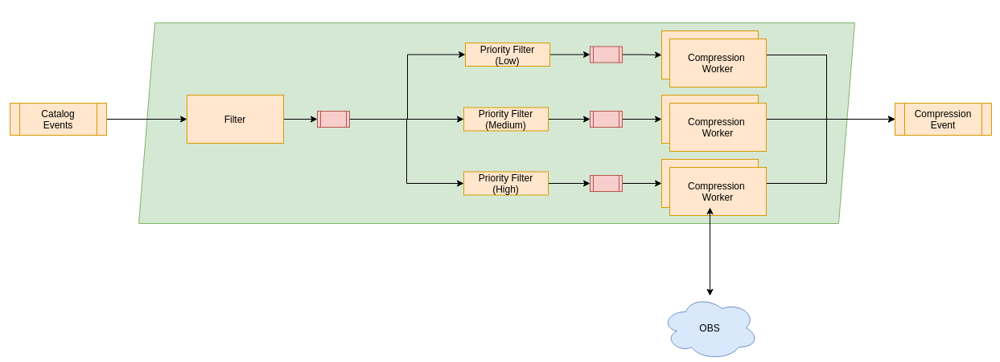

# RS Core - Compression

## General

The RS Core Compression chain is capable of performing compression operation on products that had been produced by the Reference System. It is downloading the uncompressed products into a local working directory, performing the compression operation and uploading the zipped product into the OBS. A compression event is raised that will be usually consumed by the Distribution Chain.

At the beginning of the chain there is the Compression Filter that is used as a gate for the chain and determinates what product family or product types shall be consumed by the Compression chain. Just product that are matching the criteria will be passed into the chain. All other requests will be discarded.

The Compression Router will analyze the timeliness that is required by the products and routing the products into prioritized queues. That was all requests with the same priority will be in the same queues.

On each of the priority queues a Compression Worker will be listening. These workers are doing the actual work within the chain and downloading the product mentioned in the event into a local working directory. They are then performing the configured zip command onto the product. The finished compressed product will then be uploaded into an OBS bucket followed with the zip extension.

Finally a compression event will be written mentioning the compressed products and allow other systems to react upon the compression.

## Compression Filter

TBD

## Compression Router

TBD

## Compression Worker

``app.compression-worker.compression-worker.compressionCommand``

The command that shall be used to perform the compression action. This can be used to execute a different kind of compression on the archive by providing a different compression script in the base image. By default it will be using

``/app/compression.sh`` that is doing an archive operation using the tool ``7za``.

``app.compression-worker.compression-worker.hostname``

Defines the hostname of the compression worker. This is recommend to be set to ${HOSTNAME}.

``app.compression-worker.compression-worker.workingDirectory``

The local directory of the worker that shall be used as temporary working directory to perform the compression activity. This is set by default to ``/tmp/compression``

``app.compression-worker.compression-worker.compressionTimeout``

The timeout in seconds when the compression process will be terminated. If it takes more time than the configured value, it will be considered to be hanging.

``app.compression-worker.compression-worker.requestTimeout``

The timeout of the overall request. If the request takes more seconds than configured, it is considered to be hanging.