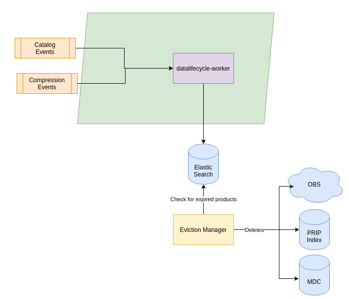

# RS Core Component - Datalifecycle

COPRS Data Lifecycle Worker chain is responsible for updating the DLM index.

## Overview



On each Catalog and Compression Event, the Data Lifecycle Worker calculates an expiration date for the file of the event in consulting the configured retentions policies and updates its index for that file. The part of DLM responsible for eviction is provided by the Eviction Manager service that is running independently. It works with a scheduler that runs periodically and checks for expired files and removes them from the Object Store, Metadata Catalog and Prip index accordingly.

## Resource Requirements

This software does have the following minimal requirements:


| Resource                    | Data Lifecycle Worker* |
|-----------------------------|-------------|
| Memory request              |    512Mi    |
| CPU request                 |    500m     |
| Memory limit                |    4000Mi   |
| CPU limit                   |    1500m    |
| Disk volume needed          |    no       |
| Disk access                 |    n/a      |
| Disk storage capacity       |    n/a      |
| Volume Mount                |    n/a      |
| Affinity between Pod / Node |    no       |

 *These resource requirements are applicable for one worker. There may be many instances of an distribution worker, see [scaling up workers](/processing-common/doc/scaling.md) for more details.

## Deployment Prerequisite
The following components of the COPRS shall be installed and running
- [COPRS Infrastructure](https://github.com/COPRS/infrastructure)
- See [COPRS OBS Bucket](/processing-common/doc/buckets.md)
- See [COPRS Kubernetes Secret](/processing-common/doc/secrets.md)

# Configuration

## General Application properties
| Property | Details |
|-|-|
|``app.*.spring.kafka.bootstrap-servers``| It is a pair of host and port where kafka brokers are running. A Kafka client connects to these servers to bootstrap the application. Comma separated values are provided for multiple enteries. Example : ``kafka-cluster-kafka-bootstrap.infra.svc.cluster.local:9092``|
|``app.*.main.banner-mode``| Disable Spring Boot Banner Using banner-mode at System Console. Default : ``off``|
|``app.*.management.endpoint.health.show-details``| Spring Boot provides a health stats for the application. Default : ``always``|
|``app.*.logging.config``| Path to the file that describes logging configuration for the application. Default : ``log/log4j2.yml``

## Error Management
| Property | Details |
|-|-|
TBD

## Elastic Search
| Property | Details |
|-|-|
|``app.*.elasticsearch.host``|Elasticsearch host name running in the Kubernetes cluster. Default: ``elasticsearch-processing-es-http.database.svc.cluster.local``| 
|``app.*.elasticsearch.port``| Elasticsearch port name running in the Kubernetes cluster. Default: ``9200``| 
|``app.*.elasticsearch.connect-timeout-ms``| Timeout for a period in which this client should establish a connection Elasticsearch Service. Example: ``2000``| 
|``app.*.elasticsearch.socket-timeout-ms``| A maximum time of inactivity between two data packets when exchanging data with a ES server. Example: ``10000``| 

## Retention Policies
A configuration for the retention policies needs to be created. This configuration is shown in the section below. Multiple policies for different type of files can be configured. Each retention policy consist of following elements:

* The product family of the relevant file for which the retention time is defined 
* A regular expresson for matching the relevant file for witch the retetnion time is defined
* The retention time 

The following example shows the configuration for some types of S1 auxiliary files:
```
app.*.data-lifecycle-worker.retention-policies.typ1.product-family=AUXILIARY_FILE_ZIP
app.*.data-lifecycle-worker.retention-policies.typ1.file-pattern=S1[ABCD_]_(OPER|AUX)_.*\\.zip
app.*.data-lifecycle-worker.retention-policies.typ1.retention-time-days=7

app.*.data-lifecycle-worker.retention-policies.typ12.product-family=AUXILIARY_FILE
app.*.data-lifecycle-worker.retention-policies.typ12.file-pattern=S1[ABCD]_OPER_AUX_OBMEMC_PDMC_
app.*.data-lifecycle-worker.retention-policies.typ12.retention-time-days=-1

app.*.data-lifecycle-worker.retention-policies.typ13.product-family=AUXILIARY_FILE
app.*.data-lifecycle-worker.retention-policies.typ13.file-pattern=S1[ABCD]_OPER_MPL_ORBSCT_
app.*.data-lifecycle-worker.retention-policies.typ13.retention-time-days=-1

app.*.data-lifecycle-worker.retention-policies.typ83.product-family=AUXILIARY_FILE
app.*.data-lifecycle-worker.retention-policies.typ83.file-pattern=S1[ABCD]_AUX_TRO
app.*.data-lifecycle-worker.retention-policies.typ83.retention-time-days=180
```
In the example, files of family AUXILIARY_FILE_ZIP that match the regular expression S1[ABCD_]_(OPER|AUX)_.*\\.zip will kept 7 days in the system until the Eviction Manager will destroy them from the OBS.

Files of family AUXILIARY_FILE that match the regular expression S1[ABCD]_OPER_AUX_OBMEMC_PDMC_ or S1[ABCD]_OPER_MPL_ORBSCT_ will not be evicted. A retention time < 0 means no eviction.

Files of family AUXILIARY_FILE that match the regular expression S1[ABCD]_AUX_TRO will kept 180 days until the Eviction Manager will destroy them from the OBS and its metadata from the MDC.

A special case can be configured for reducing the retention time after compression. Example:
```
app.*.data-lifecycle-worker.shortening-eviction-time-after-compression.l1_slice_zip=6
app.*.data-lifecycle-worker.shortening-eviction-time-after-compression.l1_acn_zip=6
```
Here, at the time a S1 slice or acn is compressed, the retention times of the corresponding uncompressed files are updated so that they will be evicted 6 days after compression. Please note that the family to configure is the 'zip' family in lower case (l1_slice_zip)

## Deployer properties

The following table only contains a few properties used by the factory default configuration. For more information please refer to the [official documentation](https://docs.spring.io/spring-cloud-dataflow/docs/current/reference/htmlsingle/#configuration-kubernetes-deployer) or COPRS-ICD-ADST-001139201 - ICD RS core.
  
| Property | Details |
|-|-|
| `deployer.<application-name>.kubernetes.namespace` | Namespace to use | 
| `deployer.<application-name>.kubernetes.livenessProbeDelay` | Delay in seconds when the Kubernetes liveness check of the app container should start checking its health status. | 
| `deployer.<application-name>.kubernetes.livenessProbePeriod` | Period in seconds for performing the Kubernetes liveness check of the app container. | 
| `deployer.<application-name>.kubernetes.livenessProbeTimeout` | Timeout in seconds for the Kubernetes liveness check of the app container. If the health check takes longer than this value to return it is assumed as 'unavailable'. | 
| `deployer.<application-name>.kubernetes.livenessProbePath` | Path that app container has to respond to for liveness check. | 
| `deployer.<application-name>.kubernetes.livenessProbePort` | Port that app container has to respond on for liveness check. | 
| `deployer.<application-name>.kubernetes.readinessProbeDelay` | Delay in seconds when the readiness check of the app container should start checking if the module is fully up and running. | 
| `deployer.<application-name>.kubernetes.readinessProbePeriod` | Period in seconds to perform the readiness check of the app container. | 
| `deployer.<application-name>.kubernetes.readinessProbeTimeout` | Timeout in seconds that the app container has to respond to its health status during the readiness check. | 
| `deployer.<application-name>.kubernetes.readinessProbePath` | Path that app container has to respond to for readiness check. | 
| `deployer.<application-name>.kubernetes.readinessProbePort` | Port that app container has to respond on for readiness check. | 
| `deployer.<application-name>.kubernetes.limits.memory` | The memory limit, maximum needed value to allocate a pod, Default unit is mebibytes, 'M' and 'G" suffixes supported | 
| `deployer.<application-name>.kubernetes.limits.cpu` | The CPU limit, maximum needed value to allocate a pod | 
| `deployer.<application-name>.kubernetes.requests.memory` | The memory request, guaranteed needed value to allocate a pod. | 
| `deployer.<application-name>.kubernetes.requests.cpu` | The CPU request, guaranteed needed value to allocate a pod. | 
| `deployer.<application-name>.kubernetes.maxTerminatedErrorRestarts` | Maximum allowed restarts for app that fails due to an error or excessive resource use. | 
