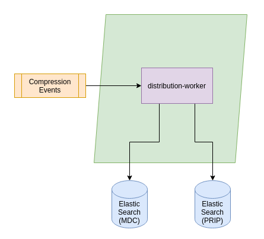

# RS Core - Distribution

COPRS Distribution chain is responsible for publishing products on the PRIP index.

# Overview



The Distribution chain is publishing products that had been produced within the COPRS on the PRIP index so the products become available for the end user via the User Web Client or the Native API. In order to publish a product via the PRIP it is required to be zipped first. So usually the products will be processed by the Compression Chain first. So the Distribution Chain will listen on the Compression Events for new products.

It is a sink and no further processing occurs. 

For details, please see [Distribution Chain Design](https://github.com/COPRS/reference-system-documentation/blob/develop/components/production%20common/Architecture%20Design%20Document/004%20-%20Software%20Component%20Design.md#distribution-chain)

# Resource Requirements

This software does have the following minimal requirements:

| Resource                    |  Distribution Worker* | 
|-----------------------------|---------------|
| Memory request              |     326Mi    |
| CPU request                 |     100m      |
| Memory limit                |     1302Mi    |
| CPU limit                   |     500m     |
| Disk volume needed          |   no  |
| Disk access                 |     n/a       |
| Disk storage                |  n/a         |
| Volume Mount                |  n/a  |         
| Affinity between Pod / Node |     no       |

 *These resource requirements are applicable for one worker. There may be many instances of an extraction worker, see [scaling up workers](/processing-common/doc/scaling.md) for more details.


# Deployment Prerequisite
Following components of the COPRS shall be installed and running
- [COPRS Infrastructure](https://github.com/COPRS/infrastructure)


# Configuration
## Application properties
| Property                   				                               | Details       |
|---------------------------------------------------------------|---------------|
|``app.*.spring.kafka.bootstrap-servers``| It is a pair of host and port where kafka brokers are running. A Kafka client connects to these servers to bootstrap the application. Comma separated values are provided for multiple enteries.Example : ``kafka-headless:9092``|
|``app.*.main.banner-mode``| Disable Spring Boot Banner Using banner-mode at System Console.Default : ``off``|
|``app.*.management.endpoint.health.show-details``| Spring Boot provides a health stats for the application. Default : ``always``|
|``app.*.logging.config``| Path to the file that describes logging configuration for the application.Default : ``log/log4j2.yml``

### Elasticsearch (ES)

| Property                   				                               | Details       |
|---------------------------------------------------------------|---------------|
|``app.*.elasticsearch.host``|Elasticsearch host name running in the Kubernetes cluster. Default: ``elasticsearch-master.monitoring``| 
|``app.*.elasticsearch.port``| Elasticsearch port name running in the Kubernetes cluster.Default: ``9200``| 
|``app.*.elasticsearch.connect-timeout-ms``| Timeout for a period in which this client should establish a connection Elasticsearch Service.Example: ``2000``| 
|``app.*.elasticsearch.socket-timeout-ms``| A maximum time of inactivity between two data packets when exchanging data with a ES server.Example: ``10000``| 


###  Distribution Worker
| Property                   				                               | Details       |
|---------------------------------------------------------------|---------------|
|``app.distribution-worker.distribution-worker.hostname``| The hostname of the distribution worker Default: ``$[HOSTNAME]}``|
|``app.distribution-worker.distribution-worker.metadata-unavailable-retries-number``| Amount of retries how often the worker will attempt to fetch the metadata from the catalog. Default:
 ``10``|
|``app.distribution-worker.distribution-worker.metadata-unavailable-retries-interval-ms``| Amount of ms the worker will wait before retrying to fetch the metadata from the catalog again. Default: ``5000``|
|``app.distribution-worker.distribution-worker.metadata-insertion-retries-number``| Amount of retries how often the worker will attempt to add a new entry into the PRIP index Default: ``3``|
|``app.distribution-worker.distribution-worker.metadata-insertion-retries-interval-ms``| Amount of ms the worker will wait before retrying to add an entry in the PRIP index. Default: ``1000``|

Additionally a configuration for the product metadata mapping needs to be created. This configuration is shown in the section below. It does basically consist of two types of configuration:
* A regular expresson define the product that shall match
* A list of metadata mappings.

The following examples are showing the configuration for a S1 Annotation file:
```
app.distribution-worker.distribution-worker.metadata.l0Ann.regexp=(S[1-6]|IW|EW|WV)_RAW__0A
app.distribution-worker.distribution-worker.metadata.l0Ann.map.attr_beginningDateTime_date=startTime
app.distribution-worker.distribution-worker.metadata.l0Ann.map.attr_endingDateTime_date=stopTime
app.distribution-worker.distribution-worker.metadata.l0Ann.map.attr_startTimeFromAscendingNode_double=startTimeANX
app.distribution-worker.distribution-worker.metadata.l0Ann.map.attr_completionTimeFromAscendingNode_double=stopTimeANX
app.distribution-worker.distribution-worker.metadata.l0Ann.map.attr_platformShortName_string=platformShortName
app.distribution-worker.distribution-worker.metadata.l0Ann.map.attr_platformSerialIdentifier_string=platformSerialIdentifier
app.distribution-worker.distribution-worker.metadata.l0Ann.map.attr_instrumentShortName_string=instrumentShortName
app.distribution-worker.distribution-worker.metadata.l0Ann.map.attr_operationalMode_string=operationalMode
app.distribution-worker.distribution-worker.metadata.l0Ann.map.attr_swathIdentifier_string=swathIdentifier
app.distribution-worker.distribution-worker.metadata.l0Ann.map.attr_productClass_string=productClass
app.distribution-worker.distribution-worker.metadata.l0Ann.map.attr_productConsolidation_string=productConsolidation
app.distribution-worker.distribution-worker.metadata.l0Ann.map.attr_instrumentConfigurationID_string=instrumentConfigurationId
app.distribution-worker.distribution-worker.metadata.l0Ann.map.attr_missionDatatakeID_long=missionDataTakeId
app.distribution-worker.distribution-worker.metadata.l0Ann.map.attr_sliceProductFlag_boolean=sliceProductFlag
app.distribution-worker.distribution-worker.metadata.l0Ann.map.attr_sliceNumber_long=sliceNumber
app.distribution-worker.distribution-worker.metadata.l0Ann.map.attr_totalSlices_long=totalNumberOfSlice
app.distribution-worker.distribution-worker.metadata.l0Ann.map.attr_polarisationChannels_string=polarisationChannels
app.distribution-worker.distribution-worker.metadata.l0Ann.map.attr_orbitNumber_long=absoluteStartOrbit
app.distribution-worker.distribution-worker.metadata.l0Ann.map.attr_relativeOrbitNumber_long=relativeStartOrbit
app.distribution-worker.distribution-worker.metadata.l0Ann.map.attr_cycleNumber_long=cycleNumber
app.distribution-worker.distribution-worker.metadata.l0Ann.map.attr_orbitDirection_string=pass
app.distribution-worker.distribution-worker.metadata.l0Ann.map.attr_processingDate_date=processingDate
app.distribution-worker.distribution-worker.metadata.l0Ann.map.attr_processingCenter_string=site
app.distribution-worker.distribution-worker.metadata.l0Ann.map.attr_processorName_string=processorName
app.distribution-worker.distribution-worker.metadata.l0Ann.map.attr_processorVersion_string=processorVersion
app.distribution-worker.distribution-worker.metadata.l0Ann.map.attr_coordinates_string=coordinates
app.distribution-worker.distribution-worker.metadata.l0Ann.map.attr_productType_string=productType
```

The first line contains the regular expression that defines a pattern on how to identify the product type. The property use the following structure:
app.distribution-worker.distribution-worker.metadata.<product_type>.regexp=<regular_expression>

``product_type`` shall be a descriptive string for the product type that can consist of the following characters `[a-zA-Z0-9]`. This string will be also used to reference the product type mapping below. The ``regular_expression`` is a regular expression that needs to match to assign the incoming product from the event in order to assign the product to the specified product type. It shall be ensured that regular expression are assigning the product only to a single product type and not matching for multiple ones.

The actual metadata mapping does follow this pattern:
``app.distribution-worker.distribution-worker.metadata.<product_type>.attr_<attribute_name>_<value_type>=<metadata_name>``

``product_type`` references the product type that shall be mapped from the section above. The ``attribute_name`` will be the name of the attribute that is stored within the PRIP index and shall be available for the product type via an OData query on the PRIP. The name shall contain normal characters and being specified in camel case.

The ``value_type`` specifies what data type the attribute shall have and can be one of the following types:
* string
* date
* double
* long
* boolean

``metadata_name`` is the name of the field of the product metadata from the catalog that shall be assigned to that attribute.

For example the following configuration:
```
app.distribution-worker.distribution-worker.metadata.l0Ann.regexp=(S[1-6]|IW|EW|WV)_RAW__0A
app.distribution-worker.distribution-worker.metadata.l0Ann.map.attr_orbitDirection_string=pass
```

Will map the field `pass` from the metadata catalog for S1 Annotation files into an PRIP index attribute `orbitDirection` that will be specified as `string`. 

## Deployer properties

The following table only contains a few properties used by the factory default configuration. For more information please refer to the [official documentation](https://docs.spring.io/spring-cloud-dataflow/docs/current/reference/htmlsingle/#configuration-kubernetes-deployer) or COPRS-ICD-ADST-001139201 - ICD RS core.
  
| Property | Details |
|-|-|
| `deployer.<application-name>.kubernetes.namespace` | Namespace to use | 
| `deployer.<application-name>.kubernetes.livenessProbeDelay` | Delay in seconds when the Kubernetes liveness check of the app container should start checking its health status. | 
| `deployer.<application-name>.kubernetes.livenessProbePeriod` | Period in seconds for performing the Kubernetes liveness check of the app container. | 
| `deployer.<application-name>.kubernetes.livenessProbeTimeout` | Timeout in seconds for the Kubernetes liveness check of the app container. If the health check takes longer than this value to return it is assumed as 'unavailable'. | 
| `deployer.<application-name>.kubernetes.livenessProbePath` | Path that app container has to respond to for liveness check. | 
| `deployer.<application-name>.kubernetes.livenessProbePort` | Port that app container has to respond on for liveness check. | 
| `deployer.<application-name>.kubernetes.readinessProbeDelay` | Delay in seconds when the readiness check of the app container should start checking if the module is fully up and running. | 
| `deployer.<application-name>.kubernetes.readinessProbePeriod` | Period in seconds to perform the readiness check of the app container. | 
| `deployer.<application-name>.kubernetes.readinessProbeTimeout` | Timeout in seconds that the app container has to respond to its health status during the readiness check. | 
| `deployer.<application-name>.kubernetes.readinessProbePath` | Path that app container has to respond to for readiness check. | 
| `deployer.<application-name>.kubernetes.readinessProbePort` | Port that app container has to respond on for readiness check. | 
| `deployer.<application-name>.kubernetes.limits.memory` | The memory limit, maximum needed value to allocate a pod, Default unit is mebibytes, 'M' and 'G" suffixes supported | 
| `deployer.<application-name>.kubernetes.limits.cpu` | The CPU limit, maximum needed value to allocate a pod | 
| `deployer.<application-name>.kubernetes.requests.memory` | The memory request, guaranteed needed value to allocate a pod. | 
| `deployer.<application-name>.kubernetes.requests.cpu` | The CPU request, guaranteed needed value to allocate a pod. | 
| `deployer.<application-name>.kubernetes.maxTerminatedErrorRestarts` | Maximum allowed restarts for app that fails due to an error or excessive resource use. | 

