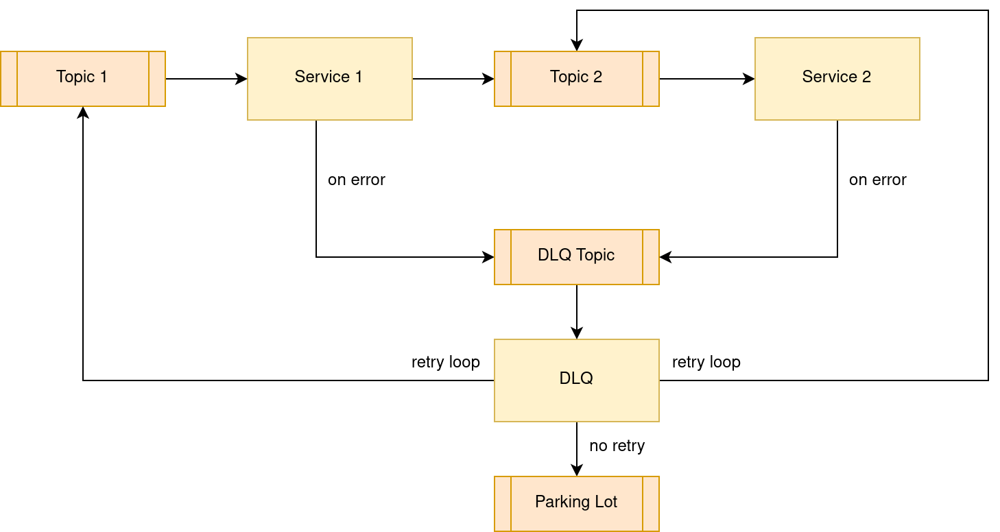

# RS Core - DLQ Manager

The RS Core component Dead Letter Queue Manager is responsible for automated restarting of failed processings.

## Overview

The DLQ Manager polls the configured dead letter queue topic for failed processing messages. The messages are then routed according to a set of routing rules. A rule consists of the following attributes.

ErrorTitle: Title of the error type
ErrorID: Regex to identify an error
ActionType:
- Restart: Republish message in error message while MaxRetry is not reached, else move it to the Parking Lot
- Delete: Ignore the message (the error will be deleted)
- NoAction: Disable rule without deleting it
TargetTopic: The target topic for restart. If not set, the original topic is used.
MaxRetry: Maximum retry for error
Comment: Description and further notes about an error
Priority: For the case when several rules match the same errorID, the rule with the highest priority is applied

Example rule table configuration:

app.dlq-manager.dlq-manager.routing.es.errorTitle=Elasticsearch issues
app.dlq-manager.dlq-manager.routing.es.errorID=.*Elasticsearch.*
app.dlq-manager.dlq-manager.routing.es.actionType=Restart
&#35;app.dlq-manager.dlq-manager.routing.es.targetTopic=
app.dlq-manager.dlq-manager.routing.es.maxRetry=1
app.dlq-manager.dlq-manager.routing.es.priority=100
&#35;app.dlq-manager.dlq-manager.routing.es.comment=
app.dlq-manager.dlq-manager.routing.timeout.errorTitle=Any Timeout
app.dlq-manager.dlq-manager.routing.timeout.errorID=.*(?i:timeout).*
app.dlq-manager.dlq-manager.routing.timeout.actionType=Restart
&#35;app.dlq-manager.dlq-manager.routing.timeout.targetTopic=
app.dlq-manager.dlq-manager.routing.timeout.maxRetry=1
app.dlq-manager.dlq-manager.routing.timeout.priority=50
&#35;app.dlq-manager.dlq-manager.routing.timeout.comment=

## Requirements

This software does have the following minimal requirements:

| Resource                    | DLQ Manager |
|-----------------------------|-------------|
| Memory request              |    512Mi    |
| CPU request                 |    500m     |
| Memory limit                |    4000Mi   |
| CPU limit                   |    1500m    |
| Disk volume needed          |    no       |
| Disk access                 |    n/a      |
| Disk storage capacity       |    n/a      |
| Volume Mount                |    n/a      |
| Affinity between Pod / Node |    no       |

## Deployer properties

The following table only contains a few properties used by the factory default configuration. For more information please refer to the [official documentation](https://docs.spring.io/spring-cloud-dataflow/docs/current/reference/htmlsingle/#configuration-kubernetes-deployer) or COPRS-ICD-ADST-001139201 - ICD RS core.
  
| Property | Details |
|-|-|
| `deployer.<application-name>.kubernetes.namespace` | Namespace to use | 
| `deployer.<application-name>.kubernetes.livenessProbeDelay` | Delay in seconds when the Kubernetes liveness check of the app container should start checking its health status. | 
| `deployer.<application-name>.kubernetes.livenessProbePeriod` | Period in seconds for performing the Kubernetes liveness check of the app container. | 
| `deployer.<application-name>.kubernetes.livenessProbeTimeout` | Timeout in seconds for the Kubernetes liveness check of the app container. If the health check takes longer than this value to return it is assumed as 'unavailable'. | 
| `deployer.<application-name>.kubernetes.livenessProbePath` | Path that app container has to respond to for liveness check. | 
| `deployer.<application-name>.kubernetes.livenessProbePort` | Port that app container has to respond on for liveness check. | 
| `deployer.<application-name>.kubernetes.readinessProbeDelay` | Delay in seconds when the readiness check of the app container should start checking if the module is fully up and running. | 
| `deployer.<application-name>.kubernetes.readinessProbePeriod` | Period in seconds to perform the readiness check of the app container. | 
| `deployer.<application-name>.kubernetes.readinessProbeTimeout` | Timeout in seconds that the app container has to respond to its health status during the readiness check. | 
| `deployer.<application-name>.kubernetes.readinessProbePath` | Path that app container has to respond to for readiness check. | 
| `deployer.<application-name>.kubernetes.readinessProbePort` | Port that app container has to respond on for readiness check. | 
| `deployer.<application-name>.kubernetes.limits.memory` | The memory limit, maximum needed value to allocate a pod, Default unit is mebibytes, 'M' and 'G" suffixes supported | 
| `deployer.<application-name>.kubernetes.limits.cpu` | The CPU limit, maximum needed value to allocate a pod | 
| `deployer.<application-name>.kubernetes.requests.memory` | The memory request, guaranteed needed value to allocate a pod. | 
| `deployer.<application-name>.kubernetes.requests.cpu` | The CPU request, guaranteed needed value to allocate a pod. | 
| `deployer.<application-name>.kubernetes.maxTerminatedErrorRestarts` | Maximum allowed restarts for app that fails due to an error or excessive resource use. | 
| `deployer.<application-name>.kubernetes.environmentVariables` | Can be used to pass additional environmental variables into the application.  This can be used for example to set JVM specific arguments to use 512m. The example given shows how the XMX argument can be set: JAVA_TOOL_OPTIONS=-Xmx512m   For further information, please consult [this](https://docs.spring.io/spring-cloud-dataflow/docs/current/reference/htmlsingle/#_environment_variables) page. |