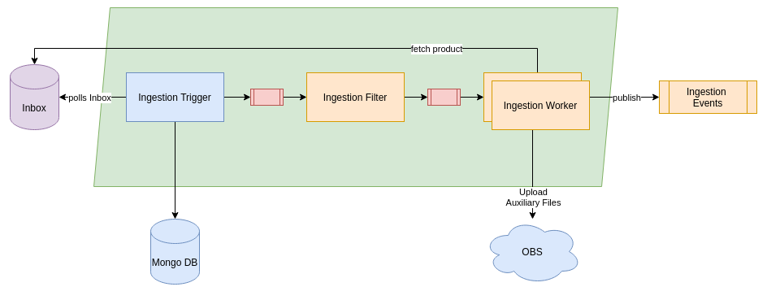

# RS Core - Ingestion

## General



The RS Core Ingestion component is able to pull data from a source into the COPRS. Supported interfaces that can be used are AUXIP, EDIP and XBIP interfaces

The Ingestion Trigger application will poll the configured source and looking for the arrival of new products. If it is detecting a matching input, it will not immediatly start to download it, but generating a new message that will be send to the filter. Products that had been detected already will be written into a MongoDB database to avoid that they are detected again.

The Ingestion Filter application will verify if the product is in the time window for products that are accepted. By default the COPRS is not processing all data arriving, but just about 3%. Products that are not within the accepted time window will be discard. If they are accepted, a message will be send to the Ingestion Worker.

The Ingestion Worker application is doing the actual I/O activity and performing the download from the configured interface. Once successfully finished, the product will be uploaded into the Object Storage and a new Ingestion Event generated to notify the COPRS that a new product had been added to the system.

## Configuration

### Ingestion Trigger

#### General

**app.ingestion-trigger.application.name**

The name of the ingestion trigger application

**app.ingestion-trigger.process.hostname**

The hostname of the ingestion trigger. This is recommend to be set to ${HOSTNAME}.

**app.ingestion-trigger.ingestion-trigger.polling-interval-ms**

The polling interval on the inbox from the trigger in milliseconds. Please keep in mind that a too short interval might have an impact on the polled system. A too high value might result in unexpected wait time until a product is detected.

#### Inboxes

Please note that the following parameters are grouped by an inbox. The name of the ``inbox`` can be a descriptive name.

**app.ingestion-trigger.ingestion-trigger.polling.\$inbox.directory**

The location of the inbox on the remote system specified by an URI. Please note that depending on the type of inbox additional configuration paramters might be required for XBIP (WebDAV), AUXIP (ODATA) or EDIP (FTP). A location for an XBIP might look like ``https://s1pro-mock-webdav-cgs01-svc/NOMINAL/``. This specifies that the trigger shall poll on the given location for new products.

**app.ingestion-trigger.ingestion-trigger.polling.\$inbox.matchRegex**

Regular expression that will be used to identify new products on the inbox while doing a poll attempt
e.g. ``^([A-Za-z_]{4}/)?([0-9A-Za-z_]{1})1([0-9A-Za-z_]{1})/([0-9A-Za-z_]+)/(ch[0|_]?[1-2]/)?(DCS_[0-9]{2}_([a-zA-Z0-9_]*)_ch([12])_(DSDB|DSIB).*\\.(raw|aisp|xml|RAW|AISP|XML))$``

**app.ingestion-trigger.ingestion-trigger.polling.\$inbox.ignoreRegex**

An regular expression that allows to specifiy a pattern of files that shall be ignored and not considered to be valid files. This is usually used to exclude temporary files or system files. e.g. ``(^\\..*|.*\\.tmp$|db.*|^lost\+found$)``

**app.ingestion-trigger.ingestion-trigger.polling.\$inbox.family**
The product family of the products detected on the inbox. In case of ingestion system this will be usually:
* EDRS_SESSION (all missions)
* AUXILIARY_FILE (Sentinel-1)
* S2_AUX (Sentinel-2)
* S3_AUX (Sentinel-3)

This information is important for the system to know into which OBS bucket the identified product shall be uploaded to.

**app.ingestion-trigger.ingestion-trigger.polling.\$inbox.stationName**

The name of the station from where the products are retrieved from e.g. ``MTI_``

**app.ingestion-trigger.ingestion-trigger.polling.\$inbox.missionId**

The identifier of the mission from the inbox in upper case:
* S1
* S2
* S3

**app.ingestion-trigger.ingestion-trigger.polling.\$inbox.station-retention-time**

Defines after how many days entries shall be deleted from the persistence of the inbox

**app.ingestion-trigger.ingestion-trigger.polling.\$inbox.ignore-files-before-date**

Defines a date. All files before this date will be ignored. e.g. ``2020-11-24T08:00:00.000Z``. This pattern can be used to avoid that all historical products from the inbox will be pulled into the system.


#### MongoDB

**app.ingestion-trigger.mongodb.host**

The hostname to the MongoDB instance that shall be used for persisting the events of the trigger to identify if a request had been fired already. Mongo is provided by the infrastructure layer.

**app.ingestion-trigger.mongodb.port**

The port of the MongoDB that shall be used when contacting the host specified under ``app.ingestion-trigger.mongodb.host``

**app.ingestion-trigger.mongodb.database**

The name of the database that shall be used within MongoDB

**app.ingestion-trigger.mongodb.username**

The username to login to the MongoDB instance

**app.ingestion-trigger.mongodb.password**

The password to login to the MongoDB instance 


#### XBIP

The configuration for the XBIP contains a set of properties that are grouped by the \$host part of the following pattern:

``app.ingestion-trigger.xbip.host-configs.\$host``

``host`` specifies the name of the group

**app.ingestion-trigger.xbip.host-configs.\$host.serverName**

The hostname of the configured XBIP host

**app.ingestion-trigger.xbip.host-configs.\$host.trustSelfSignedCertificate**

Specifies of the TLS certificate of the host is a self signed certificate

**app.ingestion-trigger.xbip.host-configs.\$host.connect-timeout-sec**

Specifies after what amount of seconds the trigger shall give up to establish a connection

**app.ingestion-trigger.xbip.host-configs.\$host.programmaticRecursion**

If the WebDAV does have infinity scan disabled, it can be activated programmatically here by the client

**app.ingestion-trigger.xbip.host-configs.\$host.enablePreemptiveAuthentication**

Defines if basic auth shall use preemptive authentication

**app.ingestion-trigger.xbip.host-configs.\$host.user**

Defines the user name that shall be used to authenticate against the XBIP instance

**app.ingestion-trigger.xbip.host-configs.\$host.pass**

Defines the password that shall be used to authenticate against the XBIP instance

#### AUXIP

TBD

#### EDIP

TBD


### Ingestion Filter
The following properties can be used in order to modify the application behaviour:

**app.ingestion-filter.application.name**

The name of the filter application that will be deployed. The name shall be descriptive to allow an easier identification, e.g. ``rs-ingestion-xbip-cgs01-filter`` for a filter used in XBIP context.

**app.ingestion-filter.process.hostname**

The hostname of the system where the application is running. This one will also used identifying the persistence database to avoid firing events twice and thus needs to be unique within the system
```
**app.ingestion-filter.ingestion-filter.polling-interval-ms**

The interval in miliseconds between the 
```
TBD: This configuration does seems to be used. Might be duplicate of trigger?

**app.ingestion-filter.ingestion-filter.config.\$mission_id.cron-definition=\$cron**

Defines the ingestion filter criteria that will be applied on the job fired by the trigger. 

``mission_id`` must equal the mission id of the event to ensure that a specific mission filter.

``cron`` defines the interval when the product will be accepted and continued to be processed. It is expressed as a [Spring Cron Expression](https://spring.io/blog/2020/11/10/new-in-spring-5-3-improved-cron-expressions).

e.g. to define a filter for Sentinel-3 that will be accepting all products on Wednesday between 0 and 8 o'clock, the property needs to be set as:
```app.ingestion-filter.ingestion-filter.config.S3.cron-definition=* * 0-8 ? * WED *```


### Ingestion Worker