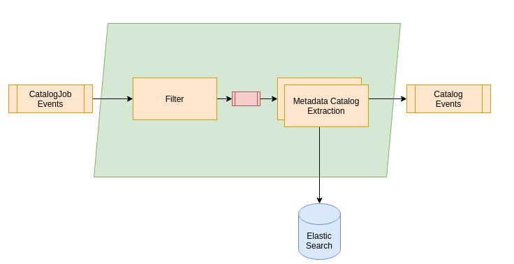

# RS Core - Metadata

COPRS Metadata chain is responsible for extrating metadata from the products related to the missions of COPRS system and persist the information in the Catalog (ES).

# Overview

TBD

For details, please see [Metadata Chain Design](https://github.com/COPRS/reference-system-documentation/blob/pro_V1.1/components/production%20common/Architecture%20Design%20Document/004%20-%20Software%20Component%20Design.md#metadata-extraction)

# Resource Requirements

This software does have the following minimal requirements:

TBD

| Resource                    |  Catalog Extract Worker* | 
|-----------------------------|---------------|
| Memory request              |     3500Mi    |
| CPU request                 |     300m      |
| Memory limit                |     4000Mi    |
| CPU limit                   |     1500m     |
| Disk volume needed          |   yes, Memory, 1500Mi  |
| Disk access                 |     yes       |
| Disk storage                |  yes          |
| Volume Mount                |  data/local-catalog  |         
| Affinity between Pod / Node |     no       |

 *These resource requirements are applicable for one worker. There may be many instances of an extraction worker, see [scaling up workers]( http://TBD for more details.

# Deployment Prerequisite
Following components of the COPRS shall be installed and running
- [COPRS Infrastructure](https://github.com/COPRS/infrastructure)
- [COPRS ingestion chain](https://github.com/COPRS/production-common/tree/develop/processing-common/ingestion)

# Configuration
## Application properties
| Property                   				                               | Details       |
|---------------------------------------------------------------|---------------|
|``app.*.spring.kafka.bootstrap-servers``| It is a pair of host and port where kafka brokers are running. A Kafka client connects to these servers to bootstrap the application. Comma separated values are provided for multiple enteries.Example : ``kafka-headless:9092``|
|``app.*.main.banner-mode``| Disable Spring Boot Banner Using banner-mode at System Console.Default : ``off``|
|``app.*.management.endpoint.health.show-details``| Spring Boot provides a health stats for the application. Default : ``always``|
|``app.*.logging.config``| Path to the file that describes logging configuration for the application.Default : ``log/log4j2.yml``

## Metadata filter properties
# TBD

| Property                   				                               | Details       |
|---------------------------------------------------------------|---------------|
|``app.metadata-filter.spring.cloud.stream.function.bindings.convertToCatalogJob-in-0=input``| ..| 
|``app.metadata-filter.spring.cloud.stream.function.bindings.convertToCatalogJob-out-0=output``|..|
|``app.metadata-filter.spring.cloud.stream.function.definition=convertToCatalogJob``|..|
|``app.metadata-filter.application.name=coprs-metadata-filter``|..| |``app.metadata-extraction.spring.cloud.stream.function.bindings.extractMetadata-in-0=input``|..|
|``app.metadata-extraction.spring.cloud.stream.function.bindings.extractMetadata-out-0=output``|..|
|``app.metadata-extraction.spring.cloud.stream.function.definition=extractMetadata``|..|
|``app.metadata-extraction.application.name=coprs-metadata-extraction``| 

### Elasticsearch (ES)

| Property                   				                               | Details       |
|---------------------------------------------------------------|---------------|
|``app.metadata-extraction.elasticsearch.host``|Elasticsearch host name running in the Kubernetes cluster. Default: ``elasticsearch-master.monitoring``| 
|``app.metadata-extraction.elasticsearch.port``| Elasticsearch port name running in the Kubernetes cluster.Default: ``9200``| 
|``app.metadata-extraction.elasticsearch.connect-timeout-ms``| Timeout for a period in which this client should establish a connection Elasticsearch Service.Example: ``2000``| 
|``app.metadata-extraction.elasticsearch.socket-timeout-ms``| A maximum time of inactivity between two data packets when exchanging data with a ES server.Example: ``10000``| 

###  Metadata Catalog Extraction
| Property                   				                               | Details       |
|---------------------------------------------------------------|---------------|
|``app.metadata-extraction.process.manifest-filenames.sen3``| Sentinel-3 product's Manifest name. Metadata conatined within this file is extracted by the extraction Service.Default: ``xfdumanifest.xml``|
|``app.metadata-extraction.process.manifest-filenames.isip``| Sentinel-1/2/3  products in an ISIP format. Metadata conatined within this file is extracted by the extraction Service.Default: ``[PRODUCTNAME]_iif.xml``|
|``app.metadata-extraction.process.manifest-filenames.safe``| Sentinel-1 SAFE format Manifest name. Metadata conatined within this file is extracted by the extraction Service.Default: ``manifest.safe``|
|``app.metadata-extraction.process.manifest-filenames.inventory``| Sentinel-1 SAFE format Manifest name. Metadata conatined within this file is extracted by the extraction Service.Default: ``Inventory_Metadata.xml``|
|``app.metadata-extraction.process.hostname``| Hostname of the Kubernetes pod that is running Metadata Extraction functionality.Default:``${HOSTNAME}``|
|``app.metadata-extraction.worker.product-categories.auxiliary-files.pattern-config``| Pattern that matches with the filenames of the auxiliary files supported by the service. Default:``^([0-9a-z][0-9a-z])([0-9a-z_])(_(OPER|TEST))?_(AMH_ERRMAT|AMV_ERRMAT|AM__ERRMAT|AUX_CAL|AUX_ICE|AUX_INS|AUX_ITC|AUX_OBMEMC|AUX_PP1|AUX_PP2|AUX_POEORB|AUX_PREORB|AUX_RESORB|AUX_SCF|AUX_SCS|AUX_TEC|AUX_TRO|AUX_WAV|AUX_WND|MPL_ORBPRE|MPL_ORBRES|MPL_ORBSCT|MSK_EW_SLC|MSK__LAND_|MSK_OCEAN_|MSK_OVRPAS)_\w{1,}\.(XML|EOF|SAFE)(/.*)?$``|
|``app.metadata-extraction.worker.product-categories.auxiliary-files.local-directory``| The local working directory available to Metadata Extraction pod, where the auxiliary-files are retrieved from the OBS in order to extract the metadata.Default:``/data/local-catalog/auxiliary_files/``|
|``app.metadata-extraction.worker.product-categories.edrs-sessions.pattern-config=``| Pattern that matches with the raw files retrieved bothfrom EDRS/XBIP interface. Default:``^([0-9a-z_]+)/(ch[0|_]?[1-2]/)?(DCS_[0-9]{2}_([a-zA-Z0-9_]*)_ch([12])_(DSDB|DSIB).*\.(raw|aisp|xml))$``|
|``app.metadata-extraction.worker.product-categories.edrs-sessions.local-directory``| The local working directory available to Metadata Extraction pod, where the auxiliary-files are retrieved from the OBS in order to extract the metadata.Default:``/data/local-catalog/edrs_sessions/``|
|``app.metadata-extraction.worker.product-categories.edrs-sessions.path-pattern``| Pattern that matches with the path raw files retrieved bothfrom EDRS/XBIP interface. Default:``^([0-9a-z_]+)/(ch[0|_]?[1-2]/)?(DCS_[0-9]{2}_([a-zA-Z0-9_]*)_ch([12])_(DSDB|DSIB).*\.(raw|aisp|xml))$``|
|``app.metadata-extraction.worker.product-categories.edrs-sessions.path-metadata-elements.missionId``| Refers to position of mtadata element `missionId` that is going to be extracted from the session path.  Default:``2``|
|``app.metadata-extraction.worker.product-categories.edrs-sessions.path-metadata-elements.satelliteId``| Refers to position of mtadata element `satelliteId` that is going to be extracted from the session path.  Default:``3``|
|``app.metadata-extraction.worker.product-categories.edrs-sessions.path-metadata-elements.sessionId``| Refers to position of mtadata element `sessionId` that is going to be extracted from the session path.  Default:``7``|
|``app.metadata-extraction.worker.product-categories.edrs-sessions.path-metadata-elements.channelId``| Refers to position of mtadata element `channelId` that is going to be extracted from the session path. Default:``8``|
|``app.metadata-extraction.worker.product-categories.plans-and-reports.pattern-config´``| Pattern for the Plan and Report files that are supported by the system. Default:``^(S1[ABCD_]_OPER_REP_MP_MP__PDMC_|S1[AB_]OPER_REP_MP_MPPDMC|S1[ABCD]_OPER_MPL_SP.{4}_PDMC_|S1[ABCD_]_OPER_MPL_FS.{4}_PDMC_|S1[ABCD]_OPER_REP_PASS_[1-9]_.{4}_|S[12]__OPER_SRA_EDRS_[AC]_PDMC_|EDR_OPER_MPL_RQ[1-9]_O[AC]_|EDR_OPER_MPL_[LM]AS_O[AC]_|EDR_OPER_MPL_CR[1-9]_O[AC]_|EDR_OPER_MPL_SS[1-9]_O[AC]_|EDR_OPER_MPL_ER[1-9]_O[AC]_|EDR_OPER_SER_SR[1-9]_O[AC]_|S1[ABCD]_OPER_MPL_ORBOEM_|EDR_OPER_MPL_GOB_P[AC]_|EDR_OPER_MPL_GOB_R[AC]_|S1[ABCD]_OPER_REP__SUP___|S1[ABCD]_OPER_REP_STNACQ_.{4}_|S1[ABCD_]_OPER_REP_STNUNV_.{4}_|S[123][ABCD_]_OPER_SRA_BANSEG_PDMC_|S1[ABCD]_OPER_TLM__REQ_[A-O]_|S1[ABCD]_OPER_REP__SMPR__|S1[ABCD]_OPER_MPL__SSC___|S1[ABCD]_OPER_TLM__PSCAT_|S1[ABCD]_OPER_MPL_OCMSAR_|S1[ABCD]_OPER_REP__MACP__|S1[ABCD]_OPER_REP__MCSF__|S1[ABCD]_OPER_MPL__NPPF__|S1[ABCD]_OPER_MPL__NPIF__|S1[ABCD]_OPER_REP_NPIFCC_|S[123][ABCD_]_OPER_SRA_GSUNAV_PDMC_|S1[ABCD]_OPER_OBS_MIMG___|S1[ABCD]_OPER_AUX_RDB____MPC__|S1[ABCD]_OPER_MPL_SESDB[ABCD]_|S1[ABCD]_OPER_REP__CHF___|S1[AB]_OPER_REP__FCHF__|S1[AB]_OPER_AM[VH_]_FAILUR_MPC__|S1[AB]_OPER_AUX_QCSTDB_|S1[AB_]_OPER_REP_QC...._MPC__|S1[AB]OPER_REPSUP__|S1[AB]OPER_REPMACP_).*(\.xml|\.XML|\.EOF|\.TGZ|\.zip|\.ZIP)?$``|
|``app.metadata-extraction.worker.product-categories.plans-and-reports.local-directory``| The local working directory available to Metadata Extraction pod, where the Plan and reports are retrieved from the OBS in order to extract the metadata.Default:``/data/local-catalog/plans_and_reports/``
|``app.metadata-extraction.worker.product-categories.level-segments.pattern-config``| Pattern for the Sentinel-1 segments.Default:``^(S1|AS)(A|B)_(S[1-6]|RF|GP|HK|IW|EW|WV|N[1-6]|EN|IM|Z[1-6]|ZE|ZI|ZW)_(SLC|GRD|OCN|RAW)(F|H|M|_)_(0)(A|C|N|S|_)(SH|__|SV|HH|HV|VV|VH|DH|DV)_([0-9a-z]{15})_([0-9a-z]{15})_([0-9]{6})_([0-9a-z_]{6})\w{1,}\.(SAFE)(/.*)?$``
|``app.metadata-extraction.worker.product-categories.level-segments.local-directory``| The local working directory available to Metadata Extraction pod, where the Sentinel-1 segment are retrieved from the OBS in order to extract the metadata.Example:``/data/local-catalog/level_segments/``|
|``app.metadata-extraction.worker.product-categories.level-products.pattern-config``| Pattern for the Sentinel-1 Level Products such as L0/L1/L2.Default:``^(S1|AS)(A|B)_(S[1-6]|RF|IW|EW|WV|GP|HK|N[1-6]|EN|IM)_(SLC|GRD|OCN|RAW)(F|H|M|_)_(0|1|2)(A|C|N|S|_)(SH|SV|HH|HV|VV|VH|DH|DV)_([0-9a-z]{15})_([0-9a-z]{15})_([0-9]{6})_([0-9a-z_]{6})\w{1,}\.(SAFE)(/.*)?$``|
|``app.metadata-extraction.worker.product-categories.level-products.local-directory``| The local working directory available to Metadata Extraction pod, where the Sentinel-1 level products are retrieved from the OBS in order to extract the metadata.Default:``/data/local-catalog/level_products/``|
|``app.metadata-extraction.worker.product-categories.s2-products.pattern-config``| Pattern for the Sentinel-2 Level Products.Default:``^(S2)(A|B|_)_([A-Z0-9]{4})_(MSI_(L0_|L1A|L1B|L1C)_(GR|DS|TL|TC))_\w{4}_(\d{8}T\d{6})(.*)$``|
|``app.metadata-extraction.worker.product-categories.s2-products.local-directory=``| The local working directory available to Metadata Extraction pod, where the Sentinel-2 level products are retrieved from the OBS in order to extract the metadata.Default:``/data/local-catalog/s2_products/``|
|``app.metadata-extraction.worker.product-categories.s3-aux.pattern-config``| Pattern for the Sentinel-3 Auxiliaries.Default:``^(([a-zA-Z0-9][a-zA-Z0-9])(\w{1})_((OL|SL|SR|DO|MW|GN|SY|TM|AX)_(0|1|2|_)_\w{4}AX)_(\d{8}T\d{6})_(\d{8}T\d{6})_(\d{8}T\d{6})_(_{17})_(\w{3})_(\w{8})\.(SEN3)\/?(.+)?$``|
|``app.metadata-extraction.worker.product-categories.s3-aux.local-directory``| The local working directory available to Metadata Extraction pod, where the Sentinel-3 Auxiliares  are retrieved from the OBS in order to extract the metadata.Default:``/data/local-catalog/s3_aux/``|
|``app.metadata-extraction.worker.product-categories.s3-products.pattern-config``| Pattern for the Sentinel-3 Auxiliaries. Default:``^([a-zA-Z0-9][a-zA-Z0-9])(\w{1})_((OL|SL|SR|DO|MW|GN|SY|TM|AX)_(0|1|2|_)_\w{4}(?!AX)\w{2})_(\d{8}T\d{6})_(\d{8}T\d{6})_(\d{8}T\d{6})_(\w{17})_(\w{3})_(\w{8})\.(SEN3|ISIP)\/?(.+)?$``|
|``app.metadata-extraction.worker.product-categories.s3-products.local-directory``| The local working directory available to Metadata Extraction pod, where the Sentinel-3 level products are retrieved from the OBS in order to extract the metadata.Default:``/data/local-catalog/s3_products/``|
|``app.metadata-extraction.worker.product-insertion.max-retries``| Number of retries the Metadata Extraction Service makes to insert the record in Elasticsearch. Default:``3``|
|``app.metadata-extraction.worker.product-insertion.tempo-retry-ms``| Time between number  of retries the Metadata Extraction Service makes to insert the record in Elasticsearch.Default:``1000``|
|``app.metadata-extraction.mdextractor.xslt-directory``| The directory available to the Extraction Service where XSLT stylesheets are located. Default:``xslt/``|
|``app.metadata-extraction.mdextractor.packet-store-types.xxxx``| These are static configuration specific to Sentinel-1 that are required for computation of timeliness. These values are taken as from MPL_OBMEMC (On-board Memory Configuration Files).|
|``app.metadata-extraction.mdextractor.type-overlapd.xxxx``| These are static configuration specific to Sentinel-1 that are required for computation of slice.|
|``app.metadata-extraction.mdextractor.type-slice.xxxx``| These are static configuration specific to Sentinel-1 that are required for computation of slice.|
|``app.metadata-extraction.mdextractor.timeliness-priority-from-high-to-low``| Order of priority for the computed Timeliness of Sentinel-1 products. Default:``PT, NRT, FAST24``|
|``app.metadata-extraction.mdextractor.fieldTypes.<metadata element>``|  Refers to the Metadata Elements that are extracted from level products and their corresponding format.  `` Default:absoluteStartOrbit=long coordinates=string creationTime=date cycleNumber=long instrumentConfigurationId=string instrumentShortName=string missionDataTakeId=long operationalMode=string pass=string platformSerialIdentifier=string platformShortName=string processingDate=date processorName=string processorVersion=string productClass=string productComposition=string productConsolidation=string productType=string qualityDataObjectID=string qualityNumOfCorruptedElements=long qualityNumOfElement=long qualityNumOfMissingElements=long qualityNumOfRSCorrectedElements=long qualityNumOfRSCorrectedSymbols=long qualityNumOfRSIncorrigibleElements=long relativeStartOrbit=long safeTimeliness=string segmentStartTime=date site=string sliceNumber=long sliceProductFlag=boolean startTimeANX=double startTime=date stopTimeANX=double stopTime=date swathIdentifier=string totalNumberOfSlice=long validityStartTime=date validityStopTime=date  

`` |
# Deployer properties
| Property                   				                               | Details       |
|---------------------------------------------------------------|---------------|
|``deployer.*.kubernetes.imagePullPolicy``|The imagePullPolicy suggest the kubelet when to pull the specified image.Default:``Always``|
|``deployer.*.kubernetes.imagePullSecrets`` | Kubernetes needs credentials to pull an image from the private registry (aretefactory). This field specifies the name of a secret that shall contain the credentials.Default:``artifactory``|
|``deployer.*.kubernetes.configMapRef``|Reference to the COPRS config map that contains key-value dataDefault:``coprs-logging-config``|
|``deployer.<POD-NAME>.kubernetes.requests.memory``| This is minimum amount of memory that is required by the pod.Kubernetes will only schedule the pod on a node that can give it required resource.|
|``deployer.<POD-NAME>.kubernetes.requests.cpu`` | This is minimum amount of memory that is required by the metadata-filter pod.Kubernetes will only schedule the pod on a node that can give it required resource.|
|``deployer.<POD-NAME>.kubernetes.limits.memory``|This is maximum amount of memory that a pod can avail.|
|``deployer.<POD-NAME>.kubernetes.volumeMounts``|The property specifies where the mounted volume within the container file-system are available to the application.|
|``deployer.<POD-NAME>.kubernetes.volumes``| Kubernetes data volume available to the application.|
|``deployer.<POD-NAME>.kubernetes.secretKeyRefs`` |Similar to ConfigMaps, contain key-value data that is required by the application. ConfigMaps are plain text data, and Secrets are used for the senstive data such as passwords,keys, credentials etc.|
