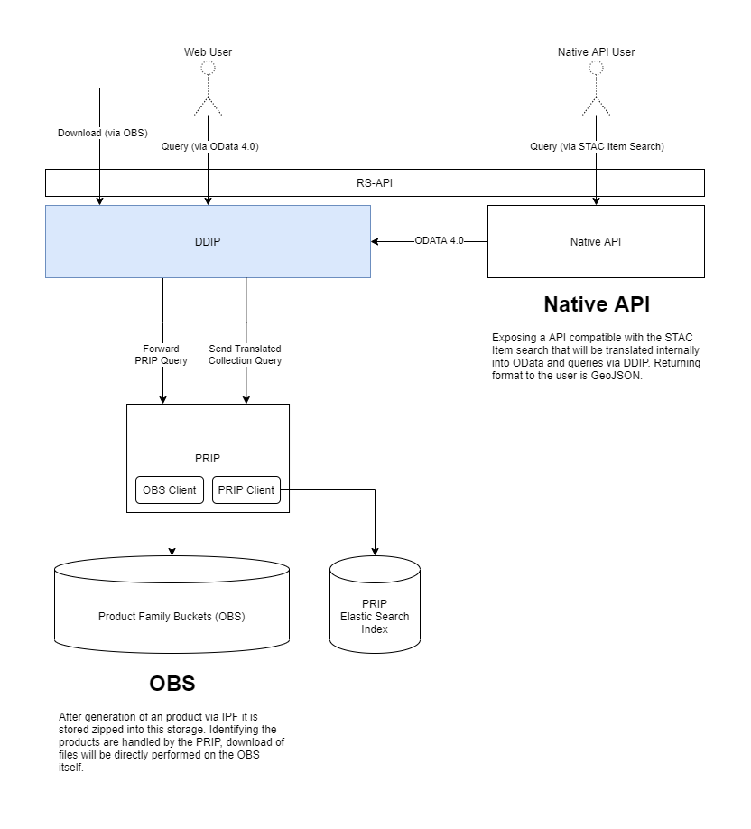

# DDIP Frontend
The DDIP Frontend functions as a facade to the PRIP and adds additional functionality like querying over collections. Together with the Native API the DDIP/PRIP forms the RS API as outgoing interface of the Copernicus Reference System. 

As a facade to the PRIP the DDIP forwards incoming PRIP requests (OData based product queries and downloads) to the PRIP frontend and returns its response. OData queries utilizing collections are handled by the DDIP Frontend by translating the query to a PRIP-compatible query before sending it to the PRIP.

<figure>
  <figcaption align="center"><b>The DDIP Frontend and its environment as part of the RS-API</b></figcaption>
</figure>

## Interface Context
### Outgoing Interfaces
The outgoing interface of the DDIP consists of PRIP functionality and additional features shown in the following table.

| DDIP Feature | Description | Example |
| --- | --- | --- |
| PRIP Queries | users can query the DDIP via OData for product metadata the same way as the PRIP (see PRIP ICD for details) | https://<service-uri>/odata/v1/Products?$filter=ContentDate/Start lt 2021-11-30T12:00:00.000000Z |
| PRIP Downloads | users can request downloads of actual product data from DDIP via OData the same way as with PRIP (see PRIP ICD for details) | https://<service-uri>/odata/v1/Products(317b0686-23cd-4ba9-962d-9906719686d2)/$value |
| Collection Queries | users can narrow the amount of product metadata returned by limiting the OData query to a defined collection | https://<service-uri>/odata/v1/Products?$filter=Collection/Name eq 'SampleCollection' |
| ... | ... | ... |
### Internal Interfaces
Inwards the DDIP interfaces to the ```PRIP``` (frontend) for product metadata queries and the download of actual product data, both via OData (see PRIP ICD for details).
