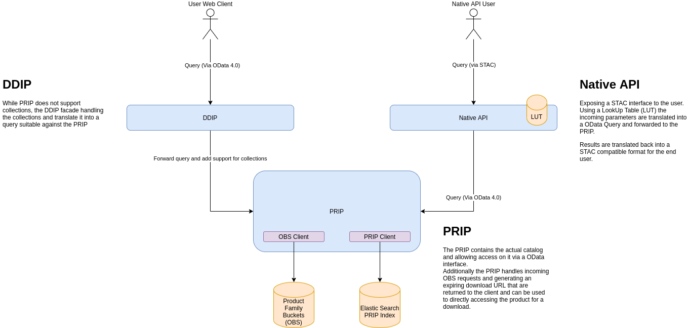

# RS Native API
The Native API is an outgoing interface of the Copernicus Reference System (COPRS). It enables users to search for processed satellite data (products) and download it. Together with the outgoing interfaces PRIP and DDIP it forms the Reference System API (RS-API).

The Native API is based on the [STAC item search](https://github.com/radiantearth/stac-api-spec/tree/master/item-search).
At this state the API supports the `GET` HTTP method for search requests and the query parameter `datetime`.

<figure>
  <figcaption align="center"><br/><b>The Native API and its environment as part of the RS-API</b></figcaption>
</figure>

## Interface Context
### Outgoing Interfaces
The outgoing interface of the Native API is described in form of an [OpenAPI document](https://github.com/COPRS/production-common/blob/b85998813ea7544f21aab471a8b54b5c80e630e2/rs-core/native-api/openapi.yml) that is readable by humans and machines alike.

### Internal Interfaces
Inwards the Native API interfaces to the ```PRIP/DDIP``` for product metadata searches via OData REST requests.
