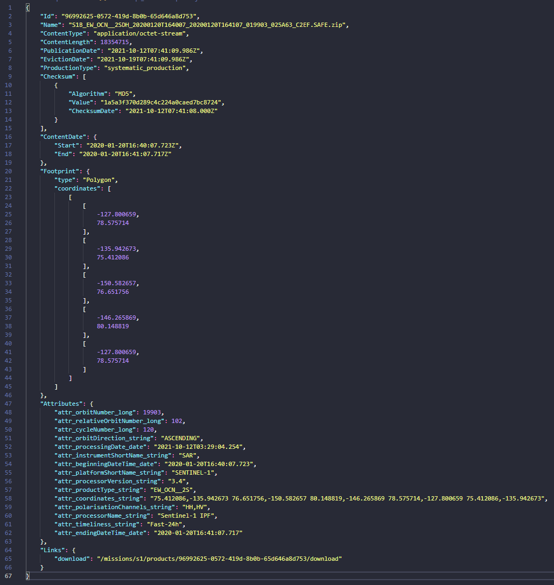

# RS Native API
The Native API is an outgoing interface of the Copernicus Reference System (COPRS). It enables users (e.g. the user web client) to search for processed satellite data (products) and download it. Together with the outgoing interfaces PRIP and DDIP it forms the Reference System API (RS-API).
<figure>
  <figcaption align="center"><b>The Native API and its environment (outlined in blue) as part of the RS-API</b></figcaption>
</figure>

## Interface Context
### Outgoing Interfaces
The outgoing interface of the Native API is described in form of an OpenAPI document that is readable by humans and machines alike. The document is used by the Native API itself to validate ingoing requests to its endpoints.
<figure>
  <figcaption align="center"><b>A render of the Native API OpenAPI document showing an overview of its endpoints</b></figcaption>
</figure>

The API is partitioned into the two parts ```Metadata``` and ```Products```, the former containing endpoints which allow to ask for metadata used to query products on endpoints in the latter part.

The current OpenAPI document can be retrieved from the running Native API service in JSON and YAML format via these URLs:
* ```[API_BASE_URL]/openapi/v3/doc```
* ```[API_BASE_URL]/openapi/v3/doc.yaml```

<figure>
  <figcaption align="center"><b>Example retrieving the Native API OpenAPI document in YAML format</b></figcaption>
</figure>

For a more informal hands-on interaction with the outgoing interface of the Native API a [Postman collection](RS-Native-API.postman_collection.json) is provided that can be imported into [Postman](https://www.postman.com/) to explore the API.

<figure>
  <figcaption align = "center"><b>Native API Postman collection</b></figcaption>
</figure>

### Internal Interfaces
Inwards the Native API interfaces to the ```PRIP storage``` for product metadata and the ```OBS storage``` for the actual product data, via the S1PRO components:
* ```prip-client```
* ```obs-sdk```

The reasons for the Native API to directly face the PRIP storage instead of the PRIP OData interface are:
* no additional network connection (```user - Native API - PRIP storage``` instead of ```user - Native API - PRIP Frontend - PRIP storage```)
* no additional mapping (```JSON/Native API model/S1PRO model/PRIP Elasticsearch``` instead of (```JSON/Native API model/PRIP OData/S1PRO model/PRIP Elasticsearch```))
* no additional parsing (```Native API query - S1PRO filter model - Elasticsearch query``` instead of ```Native API query - PRIP OData query - S1PRO filter model - Elasticsearch query```)
* flexibility: e.g. returning metadata from PRIP storage which is not returned by PRIP OData interface

## Attribtues
### Attribtues in the Native API and PRIP

| PRIP ICD | Native API searchable | PRIP OData searchable | Native API response | PRIP OData response | PRIP Elasticsearch  |
| --- | --- | --- | --- | --- | --- |
| Id | - | - | Id | Id | id |
| Name | name | Name | Name | Name | name |
| ContentType | - | - | ContentType | ContentType | contentType |
| ContentLength | contentLength | ContentLength | ContentLength | ContentLength | contentLength |
| OriginDate | - | - | - | - | - |
| PublicationDate | publicationDate | PublicationDate | PublicationDate | PublicationDate | creationDate |
| EvictionDate | evictionDate | EvictionDate | EvictionDate | EvictionDate | evictionDate |
| Checksum[]<ul><li>Algorithm</li><li>Value</li><li>ChecksumDate</li></ul> | - | - | Checksum[]<ul><li>Algorithm</li><li>Value</li><li>ChecksumDate</li></ul> | Checksum[]<ul><li>Algorithm</li><li>Value</li><li>ChecksumDate</li></ul> | checksum<ul><li>algorithm</li><li>value</li><li>checksum_date</li></ul> |
| ContentDate<ul><li>Start</li><li>End</li></ul> | contentDate.start<br/>contentDate.end | ContentDate/Start<br/>ContentDate/End | ContentDate<ul><li>Start</li><li>End</li></ul> | ContentDate<ul><li>Start</li><li>End</li></ul> | contentDateStart<br/>contentDateEnd |
| ProductionType | productionType | ProductionType | ProductionType | ProductionType | - |
| Footprint | - | via custom OData functions:<ul><li>Intersects</li><li>Within</li><li>Disjoints</li></ul> | Footprint<ul><li>type</li><li>coordinates[]</li></ul> | Footprint<ul><li>type</li><li>coordinates[]</li><li>crs<ul><li>name</li></ul></li></ul> | Footprint<ul><li>type</li><li>coordinates[]</li></ul> |
| Attributes[]<ul><li>Name</li><li>ValueType</li><li>Value</li></ul> | - | via OData Lambda operator<br/>(Attributes/Any) | Attributes[] | StringAttributes[]<br/>IntegerAttributes[]<br/>DoubleAttributes[]<br/>DateTimeOffsetAttributes[]<br/>BooleanAttributes[]<ul><li>Name</li><li>ValueType</li><li>Value</li></ul> | attr_orbitDirection_string<br/>attr_relativeOrbitNumber_long<br/>attr_startTimeFromAscendingNode_double<br/>attr_beginningDateTime_date<br/>attr_valid_boolean<br/>... |
| - | - | - | Links[]<ul><li>download</li></ul> | - | - |
| - | - | - | - | - | obsKey |
| - | - | - | - | - | productFamily |
### Native API Search Filter Attributes
The attributes that can be used to narrow the returned product metadata are:
* name
* productionType
* contentLength
* publicationDate
* evictionDate
* contentDate.start
* contentDate.end

These attributes can be retrieved over the metadata endpoints of the Native API for a specific mission. This way the user (e.g. the user web client) does not need to know exactly which attributes are available for search for a mission. If new search filter attributes are added to the Native API the user does not have to change anything.

### Native API Search Response Attributes
The attributes that are returned in the product metadata search response are:
* Id
* Name
* ContentType
* ContentLength
* PublicationDate
* EvictionDate
* ProductionType
* Checksum
    * Algorithm
    * Value
    * ChecksumDate
* ContentDate
    * Start
    * End
* Footprint
    * type
    * coordinates
* Attributes
* Links
    * download

The ```Attributes``` collection can contain additional attributes that are specific to a particular product (sub) type.

The ```Links``` collection contains actions that can be applied on the data (see [HATEOAS](https://en.m.wikipedia.org/wiki/HATEOAS)), like ```download``` containing a relative download link for the zipped product file.

<figure>
  <figcaption align = "center"><b>Example of a Native API product search response</b></figcaption>
</figure>
